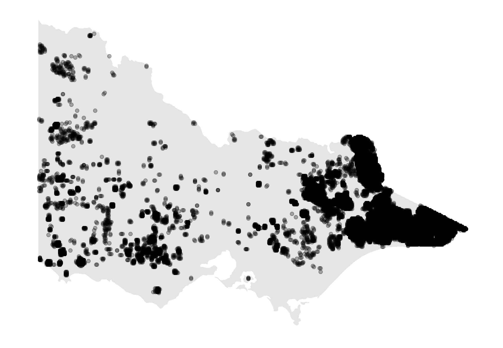

```{r setup, include=FALSE}
knitr::opts_chunk$set(
  echo = FALSE, 
  cache=FALSE, 
  message=FALSE, 
  warning=FALSE, 
  fig.retina = 3,
  fig.align = "center",
  out.width="80%")
```

```{r libraries}
library(tidyverse)
library(ggthemes)
library(sf)
library(ggpubr)
library(rnaturalearth)
library(rnaturalearthhires) # do we need, compile complains without
library(sp) # do we need, compile complains without
library(spotoroo)
library(lubridate)
library(gridExtra)
library(kableExtra)
library(ggforce)
```


## Introduction

The 2019-2020 Australia bushfire season was catastrophic in the scale of damage caused to agricultural resources, property, infrastructure, and ecological systems. By the end of 2020, the devastation attributable to these Black Summer fires included 33 lives lost, almost 19 million hectares of land burned, over 3,000 homes destroyed and AUD $1.7 billion in insurance losses, as well as an estimated 1 billion animals killed, including half of Kangaroo Island's population of koalas [@Filkov2020]. According to @climate2020, 2019 was the warmest year on record in Australia and capped off a period from 2013-2019 that represents seven of the nine warmest years. There is concern and expectation that impacts of climate change -- including more extreme temperatures, persistent drought, and changes in plant growth and landscape drying -- will worsen conditions for extreme bushfires [@climate2020, @Deb2020]. Contributing to the problem is that dry lightning represents the main source of natural ignition, and fires that start in remote areas deep in the temperate forests are difficult to access and monitor [@Abram2021]. Therefore, opportunities to detect fire ignitions, monitor bushfire spread, and understand movement patterns in remote areas are important for developing effective strategies to mitigate bushfire impact.

Remote satellite data provides a potential solution to the challenge of active fire detection and monitoring. Development of algorithms that process satellite imagery into hotspots -- pixels that represent likely fires -- is an active area of research (see for example @Giglio2016, @Xu2017, @Wickramasinghe2016, @Jang2019). Detection of bushfire ignition and movement requires the clustering of satellite hotspots into meaningful clusters, which may then be considered in their entirety or summarized by a trajectory. 

In this paper, we propose a spatiotemporal clustering algorithm to represent bushfires as clusters of hotspot pixels in order to determine points of bushfire ignition and track their movement over space and time. Inspired by two existing clustering algorithms, namely Density Based Spatial Clustering of Applications with Noise (DBSCAN) [@ester1996density] and Fire Spread Reconstruction (FSR) [@Loboda2007], our algorithm extends the functionality of DBSCAN's spatial clustering parameters to the additional temporal dimension, while drawing upon the fire movement dynamics presented in FSR. We generalize the latter's specification of spatiotemporal parameters, thereby providing an intuitive, straightforward, and extendable approach to the complex problem of bushfire identification and monitoring that may be applied to any satellite wildfire product. In clustering hotspots into bushfires of arbitrary shape and size, we capture key bushfire behavior: fire evolution occurs only forwards in time; fires can smolder undetectably for awhile, burn out, and merge with other bushfires; and solitary pixels that may not represent true fires should not be represented as a bushfire cluster. We implement this algorithm in R package \CRANpkg{spotoroo}: Spatiotemporal Clustering of Satellite Hot Spot Data, available on CRAN. By enabling the user to cluster satellite hotspot data across space and time, this software provides the ability to relate findings to key factors in bushfire ignition and patterns in their spread (e.g. weather and fuel sources). 

The core functionality of this spatiotemporal clustering algorithm determines whether a hotspot represents a new ignition point or a continuation of an existing bushfire by comparing and combining cluster membership information via incremental updates from one time frame to the next. Our algorithm first slices the hotspot data by its temporal dimension according to a user-defined time step. This thereby divides the overall spatiotemporal clustering task into many smaller spatial clustering tasks that may be completed in parallel, where each frame can be considered a static snapshot in time. Within each time frame, hotspots that fall within the threshold of a user-defined spatial metric of each other are joined in a cluster. Then, proceeding sequentially, we identify whether or not a hotspot was observed in the previous time frame. If so, it retains its cluster membership from the previous time frame; if not, the hotspot adopts the membership of the nearest hotspot with which it has been clustered. If no such neighbor exists, a hotspot represents the start of a new fire. It is important to note that each hotspot does not necessarily represent an individual fire, so similar to DBSCAN's identification of noise, those clusters that does not pass the threshold of a minimum number of hotspots or exist for a minimum amount of time are labeled noise.

As emphasized by @kisilevich2009spatio, the selection of spatial resolution and time granularity -- and relevance of domain knowledge in their choice -- are imperative to the understanding and interpretation of resulting clusters. The incorrect choice for either can be highly influential to the shape and number of clusters discovered, and in the case of satellite hotspot data, will depend on the spatial resolution and temporal frequency at which images are captured. Therefore, we present a visualization heuristic for parameter tuning that enables selection of near-optimal values of the parameters, irrespective of the exact data source.

This paper is organized as follows. The next section provides an introduction to the literature on spatiotemporal clustering and applications to bushfire modeling. Section [Algorithm] details the steps of the clustering algorithm, and [Package] introduces its implementation in \CRANpkg{spotoroo} on CRAN, including demonstration of the package's key functions and visualization capabilities. We illustrate the clustering algorithm's functionality to study bushfire ignition and spread in Victoria, Australia throughout the 2020 bushfire season in [Application], and present a visual heuristic to inform parameter selection. We make use of the Japan Aerospace Exploration Agency (JAXA) Himawari-8 satellite wildfire product [@jaxa] that identifies the location and fire radiative power (FRP) of hotspots across East Asia and Australia according to an algorithm developed by @Kurihara2020. Finally, we discuss how the results of the clustering algorithm support researchers in their study of factors that influence the start and spread of wildfires.

## Background

### Spatiotemporal clustering

@datamining2012 identify five categories of clustering algorithms: partitioning methods, hierarchical methods, density-based methods, grid-based methods, and model-based methods. Clustering of hotspot data lends itself nicely to density-based methods, which allow for the identification of clusters of various shapes and sizes, without requiring that the user pre-specify number of clusters -- these are two limitations of partitioning and hierarchical methods. We therefore focus on a review of density-based methods and refer the reader to @datamining2012 for algorithms in other categories and @kisilevich2009spatio for appropriate extensions to spatiotemporal data.

Density-based methods separate regions constituting a high density of points separated by low-density regions by identifying pairwise distances between points, and then requiring that a threshold for  [@datamining2012]. Density Based Spatial Clustering of Applications with Noise (DBSCAN) [@ester1996density] is an influential implementation of this methodology developed in 1996 designed to address three challenges of clustering algorithms: (1) requirements of domain knowledge to determine the hyperparameters, (2) arbitrary shape of clusters and (3) computational efficiency. DBSCAN defines a maximum radius $\epsilon$ to construct a neighborhood around each point. It distinguishes between a core point, for which the number of points that fall in its neighborhood meets a minimum threshold (*MinPts*), and a boundary point, whose neighborhood does not meet this threshold, but can be reached via overlapping neighborhoods from that of a core point. Intersecting neighborhoods are defined to be a cluster, while points that cannot be assigned to a cluster are identified as noise. DBSCAN also provides a heuristic to inform selection of $\epsilon$ and *MinPts*.

What is often identified as a limitation of DBSCAN -- its inability to differentiate between clusters of different densities and those adjacent to each other [@stdbscan] -- is of less concern for the application to satellite data, which by nature is a set of points corresponding to the equidistant center of pixels on grid of latitudes and longtitudes. However, its application to spatiotemporal clustering problems, which contain at least three dimensions -- spatial location (e.g. latitude and longitude) and time -- require specification of temporal granularity and treatment of temporal similarity [@kisilevich2009spatio]. As such, several extensions to DBSCAN's spatial clustering functionality have been proposed for spatiotemporal clustering solutions.

ST-DBSCAN [@stdbscan] was developed as an extension of DBSCAN's functionality to cluster points according to their non-spatial, spatial, and temporal attributes, and simultaneously address two of DBSCAN's limitations regarding identification of clusters of varying densities and differentiation of adjacent clusters. Therefore, in addition to DBSCAN's original metric to capture the spatial distance between two objects, ST-DBSCAN introduces a second metric that considers similarity of variables associated with temporal neighbors; that is, points observed in consecutive time steps.

Extensions of DBSCAN have been developed to handle incremental updates of clusters where time may impact the density of a neighborhood, and therefore the clustering membership. Incremental DBSCAN [@ester1998incremental] adjusts DBSCAN to allow for insertion and deletion of points in batch updates in a data warehouse context, with a focus on computational efficiency for implementation. @Kalnis2005 proposes exact and approximate algorithms to identify and extract moving clusters -- that is, a set of objects that move together other over space and time. The authors first partition the movement history of a set of objects into temporal snapshots and use DBSCAN at each time step to cluster objects. Clusters from consecutive snapshots are merged together if they share a minimum number of common objects, called an integrity threshold.

### Clustering of satellite hotspot data

DBSCAN has been employed for the clustering and visualization of satellite hotspot data (see for example @nisa2014 and @hermawati2016), although as discussed, it does not enable the tracking of fire ignition and movement over time.

Fire Spread Reconstruction (FSR) [@Loboda2007] addresses this limitation with the development of a tree-based algorithm that identifies fire spread in the Russian boreal forest based on active fire detections from MODIS (Moderate Resolution Imaging Spectroradiometer), which has a temporal frequency of six hours. The algorithm proposed by the authors constructs a tree based on three rules: (1) the earliest observed hotspot is the root of the tree, (2) any node is within a 2.5km radius from its parent and (3) any node is observed no later than four days from its parent. When the tree is closed and there are still unassigned hotspots, the algorithm continues at the earliest unassigned hotspot to construct a new tree. Finally, each tree is a cluster, and the earliest hotspot is defined as the ignition point.

FSR's selection of parameters is specific to the region and data product used, and is therefore not immediately generalizable to other sources of satellite hotspot data. Additionally, due to its sequential construction of fires, two that may start in different locations but result in overlapping coverage are considered to be a single fire by the time they intersect. As a result, coverage of each fire may increase dramatically in a short time period, which does not accurately reflect the natural speed of a bushfire.

## Algorithm 

Our spatiotemporal clustering algorithm consists of 4 steps, (1) divide hotspots into intervals, (2) cluster hotspots spatially, (3) update memberships, and (4) handle noise. These four steps will be described in details in the rest of the section. 


**1. Divide hotspots into intervals**

One of the characteristics of the hotspot data is cloud cover could lead to missing observations of a bushfire in several hours. As a result, two hotspots observed with a large time difference may preserve direct association. To take this feature into account, an integer parameter $activeTime$ is defined to predetermine the maximum time a fire can stay smouldering but undetectable by satellite before flaring up again.

Besides, according to the nature of bushfires, the earlier hotspots are most likely to be the source of the later hotspots nearby. Hence, the temporal dimension of the hotspot data needs to be treated separately. Our method is to define a sequence of intervals in which only spatial relationships remain. In other words, the temporal dimension is dropped completely within any given interval. 

Let $\boldsymbol{S}_t$ be a sequence of intervals defined by

$$\boldsymbol{S}_t = [max(1,t-activeTime),t]\quad t = 1,2,...,T,$$

where $max(.)$ is the maximum function, $t$ is an integer time index, and $T$ is the integer length of the time frame.

Suppose the data set contains $48$ hours of hotspot data and let $activeTime = 24~hours$, then there will be $48$ intervals defined by the algorithm, $\boldsymbol{S}_1,\boldsymbol{S}_2,\ldots,\boldsymbol{S}_{48}$, where

\begin{align*}
\boldsymbol{S}_1 &= [1,1],\\
\boldsymbol{S}_2 &= [1,2],\\
&...\\
\boldsymbol{S}_{25} &= [1,25],\\
\boldsymbol{S}_{26} &= [2,26],\\
&...\\
\boldsymbol{S}_{47} &= [23,47], \quad and\\
\boldsymbol{S}_{48} &= [24,48].
\end{align*}

**2. Cluster hotspots spatially**

The next step is to perform clustering on each of the interval. Since temporal dimension is not included, the algorithm only needs to address the the spatial relationship between hotspots. A parameter $adjDist$ is introduced to represent the potential distance a fire can spread with respect to the temporal resolution of the data. For example, given the temporal resolution of the data is $10$-minute, let $AdjDist = 3000 m$, then the potential speed of the bushfire is $3000m/10~min = 18km/h$. 

Given $AdjDist>0~m$ and an interval $\boldsymbol{S}_t$, the algorithm will perform the following substeps:

(a) Append a randomly selected hotspot $h_i$ to a empty list $\boldsymbol{L}$, where $h_i$ is the $i$th hotspot in the interval $\boldsymbol{S}_t$. And let pointer $\boldsymbol{P}$ points to the first element of the list $\boldsymbol{L}$.

(b) For every $h_i \notin \boldsymbol{L}$, if $geodesic(h_i, \boldsymbol{P})\leq AdjDist$, append $h_i$ to the list $\boldsymbol{L}$. 

(c) Move pointer $\boldsymbol{P}$ to the next item of the list $\boldsymbol{L}$.

(d) Repeat (b) and (c) until the pointer $\boldsymbol{P}$ reaches to the end of the list $\boldsymbol{L}$.

(e) For all hotspots $h_i \in \boldsymbol{L}$, assign a new membership to them. Pop these hotspots from the interval $\boldsymbol{S}_t$. Repeat (a) to (e) until interval $\boldsymbol{S}_t$ is empty.

(f) Recover the interval $\boldsymbol{S}_t$ and record the memberships.


Figure \ref{fig:step2figs} gives a concise example of this step.

```{r step2figs, fig.cap="An example of step 2 given 20 hotspots in interval $\\boldsymbol{S}_t$. (a) A hotspot is selected randomly as the first item of list $\\boldsymbol{L}$ and the pointer $\\boldsymbol{P}$. Hotspots in list $\\boldsymbol{L}$ are in red. Pointer $\\boldsymbol{P}$ is drawn with larger marker size. (b) Nearby hotspots of the pointer $\\boldsymbol{P}$ are appended to the list $\\boldsymbol{L}$. (c) Move pointer $\\boldsymbol{P}$ to the next item of list $\\boldsymbol{L}$ and append the nearby hotspots to list $\\boldsymbol{L}$. (d) The cluster is identified via repeating substep (c). (e) Clear the list $\\boldsymbol{L}$, then randomly select an unassigned hotspot to identify another cluster. (f) The final clustering result is produced via repeating substep (d). The labels show the cluster each hotspot belongs to."}

set.seed(1256)
x <- rnorm(10, mean = 0, sd = 3)
y <- rnorm(10, mean = 0, sd = 2)
x <- c(x,rnorm(10, mean = 5, sd = 2))
y <- c(y,rnorm(10, mean = 5, sd = 3))
points <- data.frame(x=x, y=y)

x <- c(x,rnorm(10, mean = 6, sd = 2))
y <- c(y,rnorm(10, mean = 7, sd = 2))
points_2 <- data.frame(x=x, y=y)

ggplot(points) +
  geom_point(aes(x,y), shape = 21, size = 1) +
  geom_point(data = NULL, aes(points$x[3], 
                              points$y[3],
                              col = "L"),
                              size = 3) +
  geom_circle(data = NULL, aes(x0 = points$x[3], y0 = points$y[3], r = 3)) +
  coord_fixed() +
  theme_bw() +
  theme(axis.line=element_blank(),
      axis.text.x=element_blank(),
      axis.text.y=element_blank(),
      axis.ticks=element_blank(),
      axis.title.x=element_blank(),
      axis.title.y=element_blank()) +
  theme(legend.position = "none") +
  scale_color_manual(values = "red") +
  labs(col = "") +
  ggtitle("Step 2: (a)") -> p1

ggplot() +
  geom_point(data = points, aes(x, y), size = 1, shape = 21) +
  geom_segment(data = NULL, aes(x = points$x[3], 
                                y = points$y[3],
                                xend = points$x[c(2, 4, 7, 11, 18)],
                                yend = points$y[c(2, 4, 7, 11, 18)])) +
  geom_point(data = NULL, aes(points$x[c(2, 4, 7, 11, 18)], 
                              points$y[c(2, 4, 7, 11, 18)],
                              col = "L")) +
  geom_point(data = NULL, aes(points$x[3], 
                              points$y[3],
                              col = "L"),
                              size = 3) +
  geom_circle(data = NULL, aes(x0 = points$x[3], y0 = points$y[3], r = 3)) +

  coord_fixed() +
  theme_bw() +
  theme(legend.position = "none") +
  theme(axis.line=element_blank(),
      axis.text.x=element_blank(),
      axis.text.y=element_blank(),
      axis.ticks=element_blank(),
      axis.title.x=element_blank(),
      axis.title.y=element_blank()) +
  scale_color_manual(values = "red") +
  labs(col = "", size = "") +
  ggtitle("Step 2: (b)") -> p2


ggplot() +
  geom_point(data = points, aes(x, y), size = 1, shape = 21) +
  geom_segment(data = NULL, aes(x = points$x[7], 
                                y = points$y[7],
                                xend = points$x[c(5, 15)],
                                yend = points$y[c(5, 15)])) +
  geom_point(data = NULL, aes(points$x[c(2, 3, 4, 11, 18, 5, 15)], 
                              points$y[c(2, 3, 4, 11, 18, 5, 15)],
                              col = "L")) +
  geom_point(data = NULL, aes(points$x[7], 
                              points$y[7],
                              col = "L"),
                              size = 3) +
  geom_circle(data = NULL, aes(x0 = points$x[7], y0 = points$y[7], r = 3)) +

  coord_fixed() +
  theme_bw() +
  theme(legend.position = "none") +
  theme(axis.line=element_blank(),
      axis.text.x=element_blank(),
      axis.text.y=element_blank(),
      axis.ticks=element_blank(),
      axis.title.x=element_blank(),
      axis.title.y=element_blank()) +
  scale_color_manual(values = "red") +
  labs(col = "", size = "") +
  ggtitle("Step 2: (c)") -> p3

ggplot() +
  geom_point(data = points, aes(x, y), size = 1, shape = 21) +
  geom_point(data = NULL, aes(points$x[c(2, 3, 4, 7, 11, 18, 5, 12, 13, 14, 15, 16, 17, 18)], 
                              points$y[c(2, 3, 4, 7, 11, 18, 5, 12, 13, 14, 15, 16, 17, 18)],
                              col = "L")) +
  
  geom_point(data = NULL, aes(points$x[16], 
                              points$y[16],
                              col = "L"),
                              size = 3) +
  geom_circle(data = NULL, aes(x0 = points$x[16], y0 = points$y[16], r = 3)) +
  coord_fixed() +
  theme_bw() +
  theme(legend.position = "none") +
  theme(axis.line=element_blank(),
      axis.text.x=element_blank(),
      axis.text.y=element_blank(),
      axis.ticks=element_blank(),
      axis.title.x=element_blank(),
      axis.title.y=element_blank()) +
  scale_color_manual(values = "red") +
  labs(col = "", size = "") +
  ggtitle("Step 2: (d)") -> p4

ggplot() +
  geom_point(data = points, aes(x, y), size = 1, shape = 21) +
  geom_point(data = NULL, aes(points$x[-c(2, 3, 4, 7, 11, 18, 5, 12, 13, 14, 15, 16, 17, 18, 19, 20)], 
                              points$y[-c(2, 3, 4, 7, 11, 18, 5, 12, 13, 14, 15, 16, 17, 18, 19, 20)],
                              col = "L")) +
  
  geom_point(data = NULL, aes(points$x[6], 
                              points$y[6],
                              col = "L"),
                              size = 3) +
  geom_circle(data = NULL, aes(x0 = points$x[6], y0 = points$y[6], r = 3)) +
  coord_fixed() +
  theme_bw() +
  theme(legend.position = "none") +
  theme(axis.line=element_blank(),
      axis.text.x=element_blank(),
      axis.text.y=element_blank(),
      axis.ticks=element_blank(),
      axis.title.x=element_blank(),
      axis.title.y=element_blank()) +
  scale_color_manual(values = "red") +
  labs(col = "", size = "") +
  ggtitle("Step 2: (e)") -> p5


point_cols <- rep(1, 20)
point_cols[c(2, 3, 4, 7, 11, 18, 5, 12, 13, 14, 15, 16, 17, 18)] <- 2
point_cols[19] <- 3
point_cols[20] <- 4

ggplot() +
  geom_text(data = points, aes(x, y, label = point_cols)) +
  coord_fixed() +
  theme_bw() +
  theme(legend.position = "none") +
  theme(axis.line=element_blank(),
      axis.text.x=element_blank(),
      axis.text.y=element_blank(),
      axis.ticks=element_blank(),
      axis.title.x=element_blank(),
      axis.title.y=element_blank()) +
  ggtitle("Step 2: (f)") -> p6


library(patchwork)

(p1 + p2 + p3)/(p4 + p5 + p6)
```


**3. Update memberships**

With spatial clustering results of each interval being produced, the next step is to update the memberships by bringing in information from earlier intervals.

This step starts from $t=2$ till $t=T$. Given the interval $\boldsymbol{S}_t$, the algorithm will perform the following substeps:

(a) For all $h_i$ belongs to $\boldsymbol{S}_{t-1}$, where $h_i$ is the $i$th hotspot in the interval $\boldsymbol{S}_{t}$, let $h_i$ carries over from its membership in $\boldsymbol{S}_{t-1}$. These hotspots are collected by a set $\boldsymbol{H}_s = \{h_s^1,h_s^2,...\}$.

(b) Let $\boldsymbol{H}_c = \{h_c^1,h_c^2,...\}$, where $h_c^i$ is the $i$th hotspot in set $\boldsymbol{H}_c$ and all $h_c^i$ belong to $\boldsymbol{S}_t$ but do not belong to $\boldsymbol{S}_{t-1}$. For all $h_c^i$ that being clustered into the same component with $h_s^j$ in interval $\boldsymbol{S}_t$, let $h_c^i$ carries over from the membership of the nearest $h_s^j$, where $h_s^j$ is the $j$th hotspot in the set $\boldsymbol{H}_s$.

Figure \ref{fig:step3figs} gives an example of this step.

```{r}
point_cols2 <- rep("a", 30)
point_cols2[19] <- "b"
point_cols2[c(1, 8, 6, 9, 10)] <- "c"

ggplot() +
  geom_point(data = points_2, aes(x, y, col = paste0("Cluster ", as.character(point_cols2)), shape = c(1:30)<=20)) +
  coord_fixed() +
  theme_bw() +
  theme(legend.position = "right") +
  theme(axis.line=element_blank(),
      axis.text.x=element_blank(),
      axis.text.y=element_blank(),
      axis.ticks=element_blank(),
      axis.title.x=element_blank(),
      axis.title.y=element_blank()) +
  labs(col = "", shape = expression("Hotspots "*" in "*S[t-1])) +
  scale_shape_manual(values = c(1, 2)) +
  ggtitle(quote(S[t])) -> p1


ggplot() +
  geom_text(data = points, aes(x, y, label = point_cols)) +
  coord_fixed() +
  theme_bw() +
  theme(legend.position = "left") +
  theme(axis.line=element_blank(),
      axis.text.x=element_blank(),
      axis.text.y=element_blank(),
      axis.ticks=element_blank(),
      axis.title.x=element_blank(),
      axis.title.y=element_blank()) +
  labs(col = "") +
  ggtitle(quote(S[t-1])) -> p2


```

```{r}
X1 <- as.data.frame(points_2[point_cols2 == "a",])
hull_1 <- chull(X1)
hull_1 <- c(hull_1, hull_1[1])

X2 <- as.data.frame(points_2[point_cols2 == "c",])
hull_2 <- chull(X2)
hull_2 <- c(hull_2, hull_2[1])

ggplot() +
  geom_text(data = points_2[1:20, ], aes(x, y, label = point_cols), col = "blue") +
  geom_point(data = points_2[21:30, ], aes(x, y), col = "red") +
  geom_polygon(data = X1[hull_1,], aes(x=x, y=y), fill = "black", alpha = 0.1) +
  geom_polygon(data = X2[hull_2,], aes(x=x, y=y), fill = "black", alpha = 0.1) +
  coord_fixed() +
  theme_bw() +
  theme(axis.line=element_blank(),
      axis.text.x=element_blank(),
      axis.text.y=element_blank(),
      axis.ticks=element_blank(),
      axis.title.x=element_blank(),
      axis.title.y=element_blank()) +
  labs(col = "", 
       shape = expression("Hotspots "*" in "*S[t-1]), 
       title = "Step 3: (a)", 
       subtitle = quote(S[t])) -> p3
```


```{r}
ggplot(data = mutate(points_2, group = rep("", 30))) +
  geom_point(aes(x, y)) +
  geom_polygon(data = X1[hull_1,], aes(x=x, y=y), fill = "black", alpha = 0.1) +
  geom_polygon(data = X2[hull_2,], aes(x=x, y=y), fill = "black", alpha = 0.1) +
  coord_fixed() +
  theme_bw() +
  theme(legend.position = "right") +
  theme(axis.line=element_blank(),
      axis.text.x=element_blank(),
      axis.text.y=element_blank(),
      axis.ticks=element_blank(),
      axis.title.x=element_blank(),
      axis.title.y=element_blank()) +
  ggtitle(bquote(S[t]~"before updating")) -> p5
```


```{r step3figs, fig.cap = "An example of step 3. In this example, there are 30 hotspots belong to interval $\\boldsymbol{S}_t$. (a) 20 out of 30 hotspots belong to both interval $\\boldsymbol{S}_t$ and interval $\\boldsymbol{S}_{t-1}$. Let these hotspots carry over from their memberships in $\\boldsymbol{S}_{t-1}$. They are annotated in blue with membership labels. Points in red are the rest 10 hotspots that only belong to interval $\\boldsymbol{S}_t$. (b) For each red point, let it carry over from the membership of the nearest blue label which shares the same component (according to the spatial clustering result of this interval) in interval $\\boldsymbol{S}_t$. "}

final_labels <- c(point_cols, 4, 2, 4, 4, 2, 2, 2, 4, 4, 2)

X1 <- as.data.frame(points_2[final_labels == "1",])
hull_1 <- chull(X1)
hull_1 <- c(hull_1, hull_1[1])

X2 <- as.data.frame(points_2[final_labels == "2",])
hull_2 <- chull(X2)
hull_2 <- c(hull_2, hull_2[1])

X3 <- as.data.frame(points_2[final_labels == "3",])
hull_3 <- chull(X3)
hull_3 <- c(hull_3, hull_3[1])

X4 <- as.data.frame(points_2[final_labels == "4",])
hull_4 <- chull(X4)
hull_4 <- c(hull_4, hull_4[1])

ggplot() +
  geom_text(data = points_2, aes(x, y, label = final_labels, col = c(1:30)<=20)) +
  geom_polygon(data = X1[hull_1,], aes(x=x, y=y), fill = "black", alpha = 0.1) +
  geom_polygon(data = X2[hull_2,], aes(x=x, y=y), fill = "black", alpha = 0.1) +
  geom_polygon(data = X3[hull_3,], aes(x=x, y=y), fill = "black", alpha = 0.1) +
  geom_polygon(data = X4[hull_4,], aes(x=x, y=y), fill = "black", alpha = 0.1) +
  coord_fixed() +
  theme_bw() +
  theme(legend.position = "none") +
  theme(axis.line=element_blank(),
      axis.text.x=element_blank(),
      axis.text.y=element_blank(),
      axis.ticks=element_blank(),
      axis.title.x=element_blank(),
      axis.title.y=element_blank()) +
  labs(col = expression("Hotspots "*" in "*S[t-1]), title = "Step 3: (b)", subtitle = quote(S[t])) +
  scale_color_manual(values = c("red", "blue")) -> p4

ggplot() +
  geom_text(data = points, aes(x, y, label = point_cols)) +
  geom_point(data = mutate(points_2, group = rep("", 30)),
             aes(x,y), col = NA) +
  coord_fixed() +
  theme_bw() +
  theme(legend.position = "none") +
  theme(axis.line=element_blank(),
      axis.text.x=element_blank(),
      axis.text.y=element_blank(),
      axis.ticks=element_blank(),
      axis.title.x=element_blank(),
      axis.title.y=element_blank()) +
  ggtitle(bquote(S[t-1])) -> p7
  

(p7 + p5 + p3 + p4)
```

**4. Handle noise**

After performing step 3, all membership labels will be produced. However, a noticeable amount of small clusters could exist. To address this issue, we provide a noise filter in the last step.

Parameter $minPts$ is the minimum number of hotspots a cluster contains and parameter $minTime$ is the minimum time a cluster lasts. Any cluster that doesn't satisfy this two conditions will be assigned with membership $-1$ to indicate noise. 

### Result

The result of the spatiotemporal clustering algorithm applied on the hotspot data is a vector of memberships with length equals to the number of observations in the data.

## Package

The implementation of our spatiotemporal algorithm is provided in the R package \CRANpkg{spotoroo}. The released version can be installed from CRAN using the following code:

```r
install.packages("spotoroo")
```

The development version can be installed from Github:

```r
devtools::install_github("TengMCing/spotoroo")
```


The following demonstration will assume the package \CRANpkg{spotoroo} and the built-in data set `hotspots` has been loaded.

```r
library(spotoroo)
data(hotspots)
```

The built-in data set `hotpsots` is a subset of a larger satellite hotspot data set which will be referred as the Victorian hotspot data. 

The Victorian hotspot data is originated from the wild fire product (produced from Himawari-8 satellite) supplied by the P-Tree System, Japan Aerospace Exploration Agency (JAXA) [-@jaxa]. This wild fire product contains records of 1989572 hotspots from October 2019 to March 2020 in the full disk of 140 \textdegree east longitude with 0.02 \textdegree spatial resolution and 10 minutes temporal resolution. 

To produce the Victorian hotspot data, two pre-processing steps are performed on the wild fire product. These include selecting hotspots within the boundary of Victoria and filtering hotspots with a threshold (irradiance over 100 watts per square metre) suggested by landscape ecologist and spatial scientist Dr. Grant Williamson [-@hotspots] to reduce noise from the background.

The final Victorian hotspot data contains 75936 observations with longitude, latitude and observed date as fields. We further select approximately 1% data which is 1070 observations from it to form the built-in data set. 

### Performing spatiotemporal cluster analysis

The main function of this package is `hotspot_cluster()`, which can be used to perform the spatiotemporal clustering algorithm on the satellite hotspot data. 

In this function, three different kinds of arguments need to be specified. Arguments `hotspots`, `lon`, `lat`, and `obsTime` are used to specify the hotspot data set and its relevant columns. Arguments `activeTime`, `adjDist`, `minPts`, and `minTime` have already been defined in the [Algorithm] section. Besides, arguments `timeUnit` and `timestep` are used to convert observed time to integer time index.

The following code is an example of the use of `hotspot_cluster()`. It set the `activeTime` to be $24$ time indexes, the `adjDist` to be $3000$ meters, the `minPts` to be $4$ hotspots, the `minTime` to be $3$ time indexes, and the difference between two adjacent time indexes to be $1$ hour.

```{r echo = TRUE, message = FALSE}
result <- hotspot_cluster(hotspots = hotspots,
                          lon = "lon",
                          lat = "lat",
                          obsTime = "obsTime",
                          activeTime = 24,
                          adjDist = 3000,
                          minPts = 4,
                          minTime = 3,
                          timeUnit = "h",
                          timeStep = 1)
```

The output of this function is a `spotoroo` object, which is actually a `list` contains two `data.frame`s called `hotspots` and `ignition`, and a `list` called `setting`.

```{r echo = TRUE, message=TRUE}
result
```

The `hotspots` data set contains information of each hotspot including the location, the observed time, the time inedex, the membership, the distance to the ignition location and the amount of time since ignition. 

```{r echo = TRUE, message=TRUE}
head(result$hotspots, 2)
```


The `ignition` data set contains information of each cluster including the ignition location, the observed time of ignition, the number of hotspots in the cluster and the time of life of the cluster. In addition, the coordinate information of the ignition points are the centroids of the earliest observed hotspots of each cluster.

```{r echo = TRUE, message=TRUE}
head(result$ignition, 2)
```

The package also provides a brief report of the clustering result in the generic function `summary()`.

```r
summary(result)
```


### Extracting a subset of clusters

The clustering result obtained from the `hotspot_cluster()` function is a `spotoroo` object which is inconvenient to be used in further analysis. To overcome this issue, the package provides a function `extract_fire()` to convert a `spotoroo` object to a `data.frame`. 

Users could choose to keep all information from the clustering result including noise points by setting `noise = TRUE` and leaving other arguments as default.

```{r echo=TRUE, message=TRUE}
all_fires <- extract_fire(result, noise = TRUE)
```

By providing a vector of indexes to the argument `cluster`, the function will extract the corresponding clusters from the clustering result.

```{r echo=TRUE, message=TRUE}
fire_1_and_2 <- extract_fire(result, cluster = c(1, 2), noise = FALSE)
```


### Visualizing the clustering result

The package provides three methods to visualize the clustering result, which all can be produced by the generic function `plot()`.


The default plot produced by the function shown in Figure \ref{fig:demodefplot} is a scatter plot of the clusters and their ignition locations representing the spatial distribution of the fires. 

According to Figure \ref{fig:demodefplot}, there are total of 6 clusters where 4 of them are at the bottom right of the plot and 2 of them are at the top left of the plot. They were all observed from December, 2019 to Feburary, 2020 which was during the 2019-2020 Australian bushfire season. Furthermore, the black dots are the ignition location of each of the cluster.

```{r demodefplot, echo=TRUE, fig.cap="Default plot."}
plot(result)
```


Figure \ref{fig:demomovplot} shows the path of the fire movement, which can be produced by setting `type = 'mov'`. The fire movement is computed by the `get_fire_mov()` function. The argument `step` controls the time difference between successive steps. Moreover, using small value of `step` will produce complex path. 

In this plot, the triangle is the start point and the circle is the end point. It shows the overall movement of each fire, where fire 1, 4 and 5 moved toward the south east, fire 2 and 6 moved toward the north west and fire 3 moved toward the south west.


```{r demomovplot, echo=TRUE, fig.cap="Fire movement plot."}
plot(result, type = "mov", step = 12)
```


The plot shown in Figure \ref{fig:demotimeline} is time line of clusters, which can be produced by setting `type = 'timeline'`. It could be used to study the intensity of the bushfire season. The green dots are hotspots except for noise and the green wave is the corresponding density. Noise are drawn with orange dots. From this plot, it can be concluded that most of the hotspots were observed in the mid-January.

```{r demotimeline, echo=TRUE, fig.cap="Timeline of clusters."}
plot(result, type = "timeline")
```

## Application  

In this section, an application will be illustrated to show how this algorithm can be used to study empirical satellite hotspots data. The data set we will use is the Victorian hotspot data, which has been mentioned in the [Package] section. The overall distribution of the hotspots is given in Figure \ref{fig:hotspots}.

```{r}
if (!file.exists("data/VIC_result.rda")) {
  him_hotspots <- read_csv("data/VIC_hotspots_before_clustering.csv")
  temptemp <- read_csv("data/VIC_hotspots_raw.csv")
  
  him_hotspots <- mutate(him_hotspots, obsTime = temptemp$`#obstime`)
  him_hotspots <- select(him_hotspots, -time_id)
  
  library(spotoroo)
  result <- hotspot_cluster(hotspots = him_hotspots,
                            lon = "lon",
                            lat = "lat",
                            obsTime = "obsTime",
                            activeTime = 24,
                            adjDist = 3000,
                            minPts = 4,
                            minTime = 3,
                            ignitionCenter = "mean",
                            timeUnit = "h",
                            timeStep = 1)
  
  
  save(result, file = "data/VIC_result.rda")
  rm(temptemp)
  rm(result)
  rm(him_hotspots)

}

load("data/VIC_result.rda")
him_hotspots <- read_csv("data/VIC_hotspots_raw.csv")
him_hotspots$fire_id <- read_csv("data/VIC_hotspots_after_clustering.csv") %>% .[['fire_id']]
```


```{r hotspots, fig.cap="The distribution of hotspots in Victoria during 2019-2020 Australia bushfire season."}
if (!file.exists("figures/before_clustering.png")){
  ggplot() +
  geom_sf(data = vic_map, col = NA) +
  geom_point(data = him_hotspots, aes(lon, lat), alpha = 0.3) +
  theme_map() -> p

  ggsave(filename = "figures/before_clustering.png", dpi = 300, plot = p)
}



```

### Clustering the Victorian hotspot data

To perform the clustering algorithm on the Victorian hotspot data, we first transform the observed time to time index by setting the time difference between two successive indexes to be $1$ hour. Then, set `activeTime` to be $24$ time indexes, `adjDist` to be $3000$ memters, `minPts` to be $3$ hotspots and `minTime` to be $3$ indexes for the algorithm. The choice of `adjDist` and `activeTime` will be justified in the section [Effects of parameter choices].

```r
result <- hotspot_cluster(hotspots = him_hotspots,
                            lon = "lon",
                            lat = "lat",
                            obsTime = "obsTime",
                            activeTime = 24,
                            adjDist = 3000,
                            minPts = 4,
                            minTime = 3,
                            timeUnit = "h",
                            timeStep = 1)
```


The clustering result shows that 407 bushfires are found from 75936 hotspots.

```{r echo=TRUE,message=TRUE}
result
```


### Determining the ignition point and time for individual fires

Based on the clustering result, ignition location for each cluster can be computed. The strategy is to select the earliest hotspot of a cluster as its ignition point. Besides, if there are multiple earliest hotspots belong to the same cluster, the centroids of these hotspots are used as the ignition locations. According to this method, ignition points over 6 months can be produced using the following code:

```r
plot(result, bg = plot_vic_map(), hotspot = FALSE)
```

The result is given in Figure \ref{fig:clusteringfinalresults}. From this plot, we observe that most of the fires were ignited in the east of Victoria and some fires were ignited in the south west of the Victoria. These areas are forests and mountains. Very few fires started near the Melbourne city which is located at the middle of Victoria.


We would like to also study the ignition time for individual fires using the following code:

```r
plot(result, type = "timeline", mainBreak = "1 month", dateLabel = "%b %d, %y")`. 
```

The result is given in Figure \ref{fig:himtimeline}. As we can see, the majority of fires were ignited from mid-December of 2019 to mid-January of 2020. Other than that, there is a significant amount of noise found in mid-December, which may implies there are some undetected fires.


```{r clusteringfinalresults, fig.cap=" The distribution of bushfire ignitions in Victoria during 2019-2020 Australian bushfire season."}
plot(result, bg = plot_vic_map(), hotspot = FALSE) 
```


```{r himtimeline, fig.cap="Timeline of fires observed in Victoria during the 2019-2020 Australian bushfire season."}
plot(result, type = "timeline", mainBreak = "1 month", dateLabel = "%b %d, %y")
```


### Tracking fire movement

We further study the movement of 4 most intensive fires located in the east of Victoria using the following code:


```{r firemovem, echo = TRUE, fig.cap="Movements of 4 most intensive fires observed in Victoria during the 2019-2020 Australian bushfire season."}

plot(result, 
     type = "mov", 
     cluster = c(order(result$ignition$obsInCluster, 
                       decreasing = TRUE)[1:4]), 
     step = 12, 
     bg = plot_vic_map())
```

The result is given in Figure \ref{fig:firemovem}. All of the fires are observed in the late December and the beginning of the January. According to the plot, 3 out of the 4 fires changed their direction at some points. Fire 163 spread toward different directions simultaneously so the centroid of the cluster didn't change much.

### Allocating resources for future fire prevention

Advanced analysis can be performed by merging the clustering result with data like recreation sites, fire stations, roads, weather and vegetation types. We conducted an research [@conart] by this method to predict the causes of bushfires in Victoria during the 2019-2020 bushfire season when the fire investigations had not been done. It yields meaningful suggestions for future fire prevention.

### Effects of parameter choices

There are two parameters that being introduced in the outline of the algorithm, which are $AdjDist$ and $ActiveTime$. The optimal choice of these two parameters is unknown but can be tuned using a visualization tool.

Consider the relationships between $AdjDist$, $ActiveTime$ and the percentage of noise points. Increase either $AdjDist$ or $ActiveTime$ will usually reduce the percentage of noise points since spatial and temporal tolerance is greater. However, if the noise points are spatially and temporally far from the meaningful clusters, increase these two parameters will not significantly reduce the number of clusters. Hence, to identify the real noise points, we only need to find the smallest pair of $AdjDist$ and $ActiveTime$ such that after those values the percentage of noise points no longer decrease significantly. Based on this rule, a visualization tool inspired by the scree plot used in the principal component analysis is developed. Similar to the scree plot, users need to determine the values of $ActiveTime$ and $AdjDist$ when they capture most of the decrease of the percentage of the noise points. Figure \ref{fig:vis1} and \ref{fig:vis2} show the parameter tuning process by using this visualization tool. The final choice of $ActiveTime$ is $24$ hours and $AdjDist$ is $3000$ metres.


```{r vis1, fig.cap="A visualization tool for parameter tuning . It works like a scree plot. Major falls of the percentage of noise points are observed when $AdjDist < 3000$ so the reasonable choice of $AdjDist$ is 3000m."}
mygrid <- read_csv("data/grid.csv")
ggplot(mygrid) +
  geom_line(aes(adjDist, noise_prop, col = factor(activeTime))) +
  scale_x_continuous(breaks = seq(1000, 10000, 1000)) +
  labs(col = "activeTime") +
  ylab("Percentage of noise points")
```

```{r vis2, fig.cap="Major falls of the percentage of noise points are observed when $ActiveTime < 24$, so the reasonable choice of $ActiveTime$ is 24 hours."}
ggplot(filter(mygrid, adjDist > 2000)) +
  geom_line(aes(activeTime, noise_prop, col = factor(adjDist))) +
  scale_x_continuous(breaks = seq(6, 48, 6)) +
  labs(col = "adjDist") +
  ylab("Percentage of noise points")
```


## Summary

## Acknowldgements

This work was made possible through funding by the Australian Centre of Excellence for Mathematical & Statistical Frontiers, which supported Emily's travel. This paper was written in `Rmarkdown` [@rmarkdown_pkg;@rmarkdown;@rmarkdown_cookbook] with `knitr`
[@knitr_pkg;@knitr]. Plots are produced `ggplot2` [@ggplot2]. 


```{r}
pagebreak <- function() {
  if(knitr::is_latex_output())
    return("\\clearpage")
  else
    return('<div style="page-break-before: always;" />')
}
```

`r pagebreak()`

\bibliography{RJreferences}
