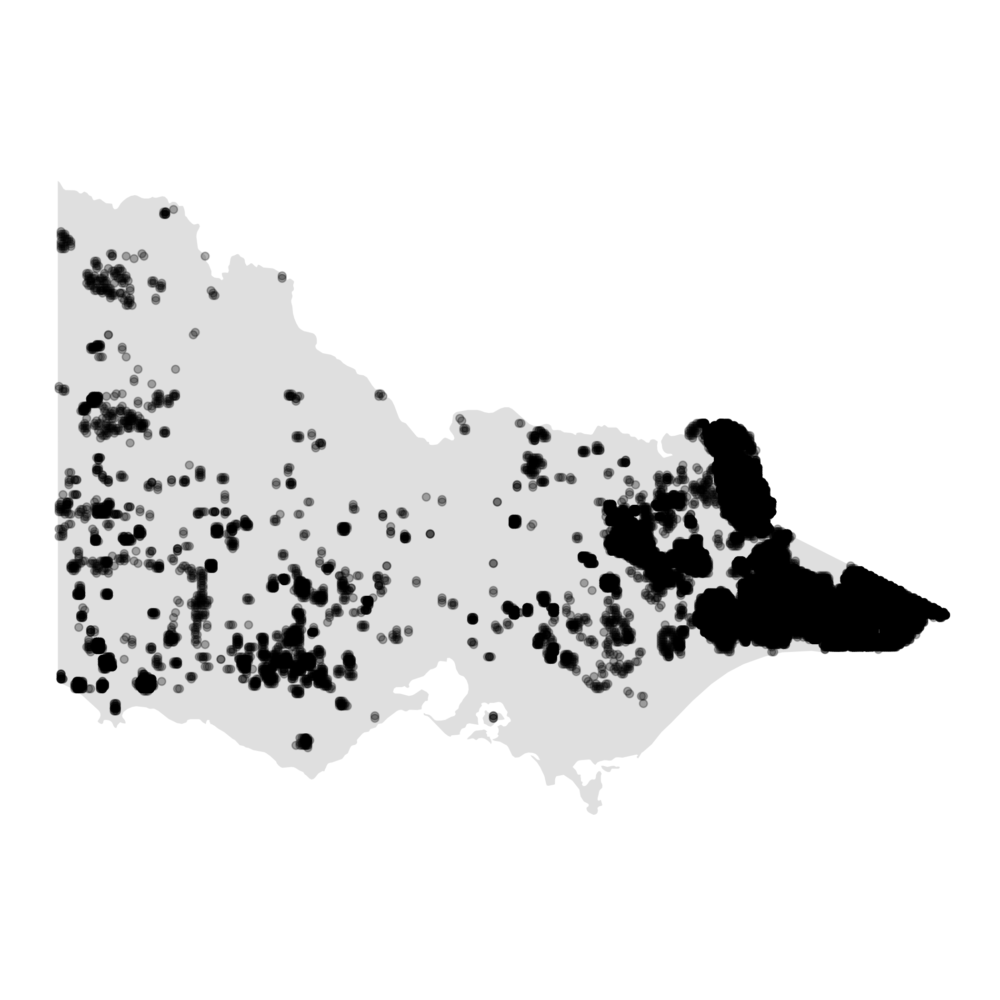

```{r setup, include=FALSE}
knitr::opts_chunk$set(
  echo = FALSE, 
  cache=FALSE, 
  message=FALSE, 
  warning=FALSE, 
  fig.retina = 3,
  fig.align = "center",
  out.width="80%")
```

```{r libraries}
library(tidyverse)
library(ggthemes)
library(sf)
library(ggpubr)
library(rnaturalearth)
library(lubridate)
library(gridExtra)
```

```{r Run-Algorithm, include = FALSE}
if (any(!file.exists(c("data/VIC_hotspots_before_clustering.csv", 
                       "data/VIC_hotspots_raw.csv")))){
  system("Rscript scripts/Clustering-Python-setup.R")
} 

if (!file.exists("data/clustering_grid.csv")){
  system("python scripts/clustering_tune.py")
} 

if (any(!file.exists(c("figures/clustering_tuning_1.jpeg", 
                       "figures/clustering_tuning_2.jpeg")))){
  system("Rscript scripts/clustering_tune_vis.R")
}

if (!file.exists("data/VIC_hotspots_after_clustering.csv")){
  system("python scripts/main.py")
}

if (!file.exists("figures/fire_mov.jpeg")){
  system("Rscript scripts/FireMov.R")
}
```


## Introduction

Bushfires are a major problem for Australia, and many other parts of the globe. There is concern that as the climate becomes hotter, and drier, that the impact of fires becomes much more severe and extensive. In Australia, the 2019-2020 fires were the worst on record causing extensive ecological damage, as well as damage to agricultural resources, properties and infrastructure. The Wollemi pine, rare prehistoric trees, required special forces intervention to prevent the last stands in the world, in remote wilderness areas, from being turned into ash. 

Contributing to the problem is that many fires started in very remote areas, locations deep into the temperate forests ignited by lightning, that are virtually impossible to access or to monitor. Satellite data provides a possible solution to this, particularly remotely sensed hotspot data, which may be useful in detecting new ignitions and movements of fires. Understanding fires in remote areas using satellite data may provide some help in developing effective strategies for mitigating bushfire impact. 

This work addresses this topic. Using hotspot data, can we cluster in space and time, in order to determine (1) points of ignition and (2) track the movement of bushfires. 

This paper is organised as follows. The next section provides an introduction to the literature on spatiotemporal clustering and bushfire modeling and dynamics. Section [Algorithm] describes the clustering algorithm, and section [Application] illustrates how the resulting data can be used to study bushfire ignition. 

<!--
- What is the data, generic structure
- Lit review: Spatio-temporal clustering. Algorithms for tracking movement.
- Bushfire literature review?
-->

## Background

literature review 


## Algorithm 

### Data source

This algorithm is initially developed in the research of 2019-2020 bushfires in Victoria, Australia. Therefore, the illustration of this algorithm will use hotspot data during 2019-2020 Australian bushfire season taken from Himawari-8 satellite [@jaxa]. This satellite hotpot dataset contains records of 1989572 hotspots for 6 months in the full disk of 140 \textdegree east longitude.

The data pre-processing procedure includes selecting hotspots within the boundary of Victoria and filtering hotspots with a threshold (irradiance over 100 watts per square metre) suggested by @hotspots  to reduce noise from the background. 

The final dataset contains 75936 hotspots with ID, longitude, latitude and observed date as fields. The map of this dataset is shown in Figure \ref{fig:hotspots}.

 

```{r}
au_map <- ne_states(country = 'Australia', returnclass = 'sf')
vic_map <- au_map[7,]
hotspots <- read_csv("data/VIC_hotspots_raw.csv")
memberships <- read_csv("data/VIC_hotspots_after_clustering.csv")
hotspots$fire_id <- memberships$fire_id
rm(memberships)
```

```{r hotspots, fig.cap="A map shows the distribution of hotspots in Victoria during 2019-2020 Australia bushfire season."}
if (!file.exists("figures/before_clustering.png")){
  ggplot() +
  geom_sf(data = vic_map) +
  geom_point(data = hotspots, aes(lon, lat), alpha = 0.3) +
  theme_map() -> p

  ggsave(filename = "figures/before_clustering.png", dpi = 300, plot = p)
}



```

### Steps

The spatiotemporal clustering algorithm is consist of 4 steps, (1) divide hotspots into intervals, (2) cluster hotspots spatially, (3) update the memberships and (4) compute ignition locations. They will be described in details in the rest of the section. 


**1. Divide hotspots into intervals**

Despite hotspot data can be represented in the three-dimensional Euclidean space and clustered using ordinary algorithms, like K-means, the clustering results could be highly sensitive to the scaling of the temporal dimension [@kisilevich2009spatio]. Besides, one of the characteristics of the hotspot data is cloud cover could lead to missing observations of a bushfire in several hours. It suggests that hotspots with long intervals may belong to the same bushfire. One possible solution to this issue is dividing hotspot data into intervals. In other words, the temporal dependence between hotspots is predetermined by a parameter $ActiveTime$. The interpretation of $ActiveTime$ is the time a fire can stay smouldering but undetectable by satellite before flaring up again. 

Given a certain value of $ActiveTime$ and the length of the time frame $T$, the algorithm will define several intervals,

$$\boldsymbol{S}_t = [max(1,t-ActiveTime),t],~~t = 1,2,...,T$$

,where $T$ and $t$ have the same unit as $ActiveTime$. 

For example, if the dataset contains 48 hours of hotspot data and the $ACtiveTime = 24~hours$, there will be 48 intervals, $\boldsymbol{S}_1,\boldsymbol{S}_2,..,\boldsymbol{S}_{48}$, where

\begin{align*}
\boldsymbol{S}_1 &= [1,1]\\
\boldsymbol{S}_2 &= [1,2]\\
&...\\
\boldsymbol{S}_{25} &= [1,25]\\
\boldsymbol{S}_{26} &= [2,26]\\
&...\\
\boldsymbol{S}_{47} &= [23,47]\\
\boldsymbol{S}_{48} &= [24,48]
\end{align*}

**2. Cluster hotspots spatially**

The previous step breaks the temporal dimension. Hence, the following step only needs to address the hotspots spatially by introducing another parameter $AdjDist$. $AdjDist$ represents the potential distance a fire can spread with respect to the temporal resolution of the data. For example, let $AdjDist = 3000 m$ and the temporal resolution of the data is 10-minute, then the potential speed of the bushfire is $3000m/10~min = 18km/h$. 

Given a fixed value of $AdjDist$ and the interval $\boldsymbol{S}_t$, the algorithm will: 

(a) Append a randomly selected hotspot $h_i$ to a empty list $\boldsymbol{L}$, where $h_i$ is the $i$th hotspot in the interval $\boldsymbol{S}_t$, and let pointer $\boldsymbol{P}$ points to the first element of the list $\boldsymbol{L}$.

(b) Visit every $h_i$ where $h_i \notin \boldsymbol{L}$. If $geodesic(h_i, \boldsymbol{P})\leq AdjDist$, append $h_i$ to list $\boldsymbol{L}$. 

(c) Move pointer $\boldsymbol{P}$ to the next item of the list $\boldsymbol{L}$.

(d) Repeat (b) and (c) till the pointer $\boldsymbol{P}$ reaches to the end of the list $\boldsymbol{L}$.

(e) For all hotspots $h_i \in \boldsymbol{L}$, assign a new membership to them. Pop these hotspots from the interval $\boldsymbol{S}_t$. Repeat (a) to (e) if interval $\boldsymbol{S}_t$ is not empty.

(f) Recover the interval $\boldsymbol{S}_t$ and record the memberships.


Diagram \ref{fig:step2figs} shows an example of this step.

```{r step2figs, fig.cap="An example of step 2 given 20 hotspots in interval $\\boldsymbol{S}_t$. (a) A hotspot is selected randomly as the first item of list $\\boldsymbol{L}$ and the pointer $\\boldsymbol{P}$. Hotspots in list $\\boldsymbol{L}$ are in red. Pointer $\\boldsymbol{P}$ is drawn with larger marker size. (b) Nearby hotspots of the pointer $\\boldsymbol{P}$ are appended to the list $\\boldsymbol{L}$. (c) Move pointer $\\boldsymbol{P}$ to the next item of list $\\boldsymbol{L}$ and append the nearby hotspots to list $\\boldsymbol{L}$. (d) The first cluster is identified via repeating substep (c). (e) Clear the list $\\boldsymbol{L}$, then randomly select an unassigned hotspot to identify another cluster. (f) The final clustering result is produced via repeating substep (d). The labels show the cluster each hotspot belongs to."}

set.seed(1256)
x <- rnorm(10, mean = 0, sd = 3)
y <- rnorm(10, mean = 0, sd = 2)
x <- c(x,rnorm(10, mean = 5, sd = 2))
y <- c(y,rnorm(10, mean = 5, sd = 3))
points <- data.frame(x=x, y=y)

x <- c(x,rnorm(10, mean = 6, sd = 2))
y <- c(y,rnorm(10, mean = 7, sd = 2))
points_2 <- data.frame(x=x, y=y)

ggplot(points) +
  geom_point(aes(x,y), shape = 21, size = 1) +
  geom_point(data = NULL, aes(points$x[3], 
                              points$y[3],
                              col = "L"),
                              size = 3) +
  geom_text(data = NULL, aes(points$x[3], points$y[3], label = "P"), size = 2) +
  coord_fixed() +
  theme_bw() +
  theme(axis.line=element_blank(),
      axis.text.x=element_blank(),
      axis.text.y=element_blank(),
      axis.ticks=element_blank(),
      axis.title.x=element_blank(),
      axis.title.y=element_blank()) +
  theme(legend.position = "none") +
  scale_color_manual(values = "red") +
  labs(col = "") +
  ggtitle("Step 2: (a)") -> p1

ggplot() +
  geom_point(data = points, aes(x, y), size = 1, shape = 21) +
  geom_segment(data = NULL, aes(x = points$x[3], 
                                y = points$y[3],
                                xend = points$x[c(2, 4, 7, 11, 18)],
                                yend = points$y[c(2, 4, 7, 11, 18)])) +
  geom_point(data = NULL, aes(points$x[c(2, 4, 7, 11, 18)], 
                              points$y[c(2, 4, 7, 11, 18)],
                              col = "L")) +
  geom_point(data = NULL, aes(points$x[3], 
                              points$y[3],
                              col = "L"),
                              size = 3) +
  geom_text(data = NULL, aes(points$x[3], points$y[3], label = "P"), size = 2) +

  coord_fixed() +
  theme_bw() +
  theme(legend.position = "none") +
  theme(axis.line=element_blank(),
      axis.text.x=element_blank(),
      axis.text.y=element_blank(),
      axis.ticks=element_blank(),
      axis.title.x=element_blank(),
      axis.title.y=element_blank()) +
  scale_color_manual(values = "red") +
  labs(col = "", size = "") +
  ggtitle("Step 2: (b)") -> p2


ggplot() +
  geom_point(data = points, aes(x, y), size = 1, shape = 21) +
  geom_segment(data = NULL, aes(x = points$x[7], 
                                y = points$y[7],
                                xend = points$x[c(5, 15)],
                                yend = points$y[c(5, 15)])) +
  geom_point(data = NULL, aes(points$x[c(2, 3, 4, 11, 18, 5, 15)], 
                              points$y[c(2, 3, 4, 11, 18, 5, 15)],
                              col = "L")) +
  geom_point(data = NULL, aes(points$x[7], 
                              points$y[7],
                              col = "L"),
                              size = 3) +
  geom_text(data = NULL, aes(points$x[7], points$y[7], label = "P"), size = 2) +

  coord_fixed() +
  theme_bw() +
  theme(legend.position = "right") +
  theme(axis.line=element_blank(),
      axis.text.x=element_blank(),
      axis.text.y=element_blank(),
      axis.ticks=element_blank(),
      axis.title.x=element_blank(),
      axis.title.y=element_blank()) +
  scale_color_manual(values = "red") +
  labs(col = "", size = "") +
  ggtitle("Step 2: (c)") -> p3

ggplot() +
  geom_point(data = points, aes(x, y), size = 1, shape = 21) +
  geom_point(data = NULL, aes(points$x[c(2, 3, 4, 7, 11, 18, 5, 12, 13, 14, 15, 16, 17, 18)], 
                              points$y[c(2, 3, 4, 7, 11, 18, 5, 12, 13, 14, 15, 16, 17, 18)],
                              col = "L")) +
  
  geom_point(data = NULL, aes(points$x[16], 
                              points$y[16],
                              col = "L"),
                              size = 3) +
  geom_text(data = NULL, aes(points$x[16], points$y[16], label = "P"), size = 2) +
  coord_fixed() +
  theme_bw() +
  theme(legend.position = "none") +
  theme(axis.line=element_blank(),
      axis.text.x=element_blank(),
      axis.text.y=element_blank(),
      axis.ticks=element_blank(),
      axis.title.x=element_blank(),
      axis.title.y=element_blank()) +
  scale_color_manual(values = "red") +
  labs(col = "", size = "") +
  ggtitle("Step 2: (d)") -> p4

ggplot() +
  geom_point(data = points, aes(x, y), size = 1, shape = 21) +
  geom_point(data = NULL, aes(points$x[-c(2, 3, 4, 7, 11, 18, 5, 12, 13, 14, 15, 16, 17, 18, 19, 20)], 
                              points$y[-c(2, 3, 4, 7, 11, 18, 5, 12, 13, 14, 15, 16, 17, 18, 19, 20)],
                              col = "L")) +
  
  geom_point(data = NULL, aes(points$x[6], 
                              points$y[6],
                              col = "L"),
                              size = 3) +
  geom_text(data = NULL, aes(points$x[6], points$y[6], label = "P"), size = 2) +
  coord_fixed() +
  theme_bw() +
  theme(legend.position = "none") +
  theme(axis.line=element_blank(),
      axis.text.x=element_blank(),
      axis.text.y=element_blank(),
      axis.ticks=element_blank(),
      axis.title.x=element_blank(),
      axis.title.y=element_blank()) +
  scale_color_manual(values = "red") +
  labs(col = "", size = "") +
  ggtitle("Step 2: (e)") -> p5


point_cols <- rep(1, 20)
point_cols[c(2, 3, 4, 7, 11, 18, 5, 12, 13, 14, 15, 16, 17, 18)] <- 2
point_cols[19] <- 3
point_cols[20] <- 4

ggplot() +
  geom_text(data = points, aes(x, y, label = point_cols)) +
  coord_fixed() +
  theme_bw() +
  theme(legend.position = "right") +
  theme(axis.line=element_blank(),
      axis.text.x=element_blank(),
      axis.text.y=element_blank(),
      axis.ticks=element_blank(),
      axis.title.x=element_blank(),
      axis.title.y=element_blank()) +
  ggtitle("Step 2: (f)") -> p6


library(patchwork)

(p1 + p2 + p3)/(p4 + p5 + p6)
```


**3. Update the memberships**

With clustering results for each interval, the next step is to update the memberships by bringing in information from earlier intervals.

This step starts from $t=2$ till $t=T$. Given the interval $\boldsymbol{S}_t$, the algorithm will,

(a) Let $h_i$ succeeds its membership from $\boldsymbol{S}_{t-1}$, if $h_i$ belongs to $\boldsymbol{S}_{t-1}$, where $h_i$ is the $i$th hotspot in the interval $\boldsymbol{S}_t$. These hotspots are collected by a set $\boldsymbol{H}_s = \{h_s^1,h_s^2,...\}$.

(b) Set $\boldsymbol{H}_c = \{h_c^1,h_c^2,...\}$, where $h_c^i$ is the $i$th hotspot in set $\boldsymbol{H}_c$. $h_c^i$ belongs to $\boldsymbol{S}_t$ but does not belong to $\boldsymbol{S}_{t-1}$. If $h_c^i$ being clustered into the same component with $h_s^j$ in interval $\boldsymbol{S}_t$, $h_c^i$ succeeds the membership from the nearest $h_s^j$, where $h_s^j$ is the $j$th hotspot in set $\boldsymbol{H}_s$. 

Diagram \ref{fig:step3figs} shows an example of this step.

```{r}
point_cols2 <- rep("a", 30)
point_cols2[19] <- "b"
point_cols2[c(1, 8, 6, 9, 10)] <- "c"

ggplot() +
  geom_point(data = points_2, aes(x, y, col = paste0("Cluster ", as.character(point_cols2)), shape = c(1:30)<=20)) +
  coord_fixed() +
  theme_bw() +
  theme(legend.position = "right") +
  theme(axis.line=element_blank(),
      axis.text.x=element_blank(),
      axis.text.y=element_blank(),
      axis.ticks=element_blank(),
      axis.title.x=element_blank(),
      axis.title.y=element_blank()) +
  labs(col = "", shape = expression("Hotspots "*" in "*S[t-1])) +
  scale_shape_manual(values = c(1, 2)) +
  ggtitle(quote(S[t])) -> p1


ggplot() +
  geom_text(data = points, aes(x, y, label = point_cols)) +
  coord_fixed() +
  theme_bw() +
  theme(legend.position = "left") +
  theme(axis.line=element_blank(),
      axis.text.x=element_blank(),
      axis.text.y=element_blank(),
      axis.ticks=element_blank(),
      axis.title.x=element_blank(),
      axis.title.y=element_blank()) +
  labs(col = "") +
  ggtitle(quote(S[t-1])) -> p2


```

```{r}
ggplot() +
  geom_text(data = points_2[1:20, ], aes(x, y, label = point_cols), col = "blue") +
  geom_point(data = points_2[21:30, ], aes(x, y), col = "red") +
  coord_fixed() +
  theme_bw() +
  theme(axis.line=element_blank(),
      axis.text.x=element_blank(),
      axis.text.y=element_blank(),
      axis.ticks=element_blank(),
      axis.title.x=element_blank(),
      axis.title.y=element_blank()) +
  labs(col = "", 
       shape = expression("Hotspots "*" in "*S[t-1]), 
       title = "Step 3: (a)", 
       subtitle = quote(S[t])) -> p3
```


```{r}
ggplot(data = mutate(points_2, group = rep("", 30))) +
  geom_text(aes(x, y, label = toupper(point_cols2))) +
  coord_fixed() +
  theme_bw() +
  theme(legend.position = "right") +
  theme(axis.line=element_blank(),
      axis.text.x=element_blank(),
      axis.text.y=element_blank(),
      axis.ticks=element_blank(),
      axis.title.x=element_blank(),
      axis.title.y=element_blank()) +
  ggtitle(bquote(S[t]~"before step 3 update")) -> p5
```


```{r step3figs, fig.cap = "An example of step 3. In this example, there are 30 hotspots in interval $\\boldsymbol{S}_t$ (a) 20 out of 30 hotspots belong to both interval $\\boldsymbol{S}_t$ and interval $\\boldsymbol{S}_{t-1}$. These hotspots succeed their memberships from $\\boldsymbol{S}_{t-1}$. They are annotated in blue with membership labels. Points in red are the rest 10 hotspots that only belong to interval $\\boldsymbol{S}_t$. (b) For each red point, succeeds the nearest blue label that shares the same component (according to the left plot) with that red point in interval $\\boldsymbol{S}_t$. "}
ggplot() +
  geom_text(data = points_2, aes(x, y, label = c(point_cols, 4, 2, 4, 4, 2, 2, 2, 4, 4, 2) , col = c(1:30)<=20)) +
  coord_fixed() +
  theme_bw() +
  theme(legend.position = "none") +
  theme(axis.line=element_blank(),
      axis.text.x=element_blank(),
      axis.text.y=element_blank(),
      axis.ticks=element_blank(),
      axis.title.x=element_blank(),
      axis.title.y=element_blank()) +
  labs(col = expression("Hotspots "*" in "*S[t-1]), title = "Step 3: (b)", subtitle = quote(S[t])) +
  scale_color_manual(values = c("red", "blue")) -> p4

(p5 + p3 + p4)
```

**4. Compute ignition locations**

The previous step assigns all hotspots with updated memberships. Hence, the final step is to compute the ignition location for each cluster. If there are multiple earliest hotspots belong to the same cluster, the centroid of these hotspots is used as the ignition location. Otherwise, the earliest hotspot is used as the ignition location.   

### Effects of parameter choices

There are two parameters that can be tuned in this algorithm, which are $AdjDist$ and $ActiveTime$. Increase $AdjDist$ or the $ActiveTime$ will usually reduce the number of clusters. However, if there are large gaps between clusters spatially and temporally, increase $ActiveTime$ and $AdjDist$ will not significantly reduce the number of clusters. Given one of the metrics to evaluate the goodness of the clustering is the gap between clusters, the optimal choice of $AdjDist$ and $ActiveTime$ can be chosen when they have minimum impact on the number of clusters. However, under this setting, the optimal $ActiveTime$ and $AdjDist$ will approach to infinitely as the number of clusters approach to 1. Hence, a restriction needs to be applied on this optimization. Increase of $ActiveTime$ and $AdjDist$ will only be allowed when there is a major fall of the number of clusters. Due to its similarity to determining the number of principal components to keep in a principal component analysis, a visualization tool is developed inspired by the scree plot. 


```{r vis1, fig.cap="A visualization tool for parameter tuning . It works like a scree plot. Major falls of the number of clusters are observed when $AdjDist < 3000$ so the reasonable choice of $AdjDist$ is 3000m."}
knitr::include_graphics("figures/clustering_tuning_1.jpeg")
```

```{r vis2, fig.cap="Major falls of the number of clusteres are observed when $ActiveTime < 24$, so the reasonable choice of $ActiveTime$ is 24 hours."}
knitr::include_graphics("figures/clustering_tuning_2.jpeg")
```


## Application

### Determining the ignition point and time for individual fires

By applying the spatiotemporal clustering algorithm on the hotspot data shown in Figure \ref{fig:hotspots}, bushfires can be identified and ignition locations can be computed. The corresponding clustering results are given in Figure \ref{fig:clusteringfinalresults}.

```{r clusteringfinalresults, fig.cap="A map shows the distribution of bushfire ignition locations in Victoria during 2019-2020 Australia bushfire season."}
hotspots %>%
  group_by(fire_id) %>%
  summarise(hour_id = min(hour_id)) %>%
  ungroup() -> temp

ignition <- left_join(temp, hotspots) %>%
  group_by(fire_id) %>%
  summarise(time = mean(`#obstime`), lon = mean(lon), lat = mean(lat))

ggplot(ignition) +
  geom_sf(data = vic_map) +
  geom_point(aes(lon, lat)) +
  theme_map()
  
```

<center> <em> Show ignition points for a particularly heavy day and another for a particularly light day </em> </center>

```{r}
ignition <- mutate(ignition, year = year(time), month = month(time), day = day(time))
```

```{r app2, fig.cap=""}
# light
filter(ignition, year == 2020, month == 1, day == 24) %>%
ggplot() +
  geom_sf(data = vic_map) +
  geom_point(aes(lon, lat)) +
  ggtitle("2020.01.24")
```
```{r app3, fig.cap=""}
# heavy
filter(ignition, year == 2019, month == 12, day == 18) %>%
ggplot() +
  geom_sf(data = vic_map) +
  geom_point(aes(lon, lat)) +
  ggtitle("2019.12.18")
```


### Tracking fire movement

<center> <em> Display showing how a fire moves over time, maybe two or more fires </em> </center>


### Allocating resources for future fire prevention

Merging data with camp sites, CFA, roads, ... 

## Summary


<!--
This file is only a basic article template. For full details of _The R Journal_ style and information on how to prepare your article for submission, see the [Instructions for Authors](https://journal.r-project.org/share/author-guide.pdf).
-->

## Acknowledgements

- The code and files to reproduce this work are at XXX
- Data on hotspots can be downloaded from XXX


\bibliography{RJreferences}
