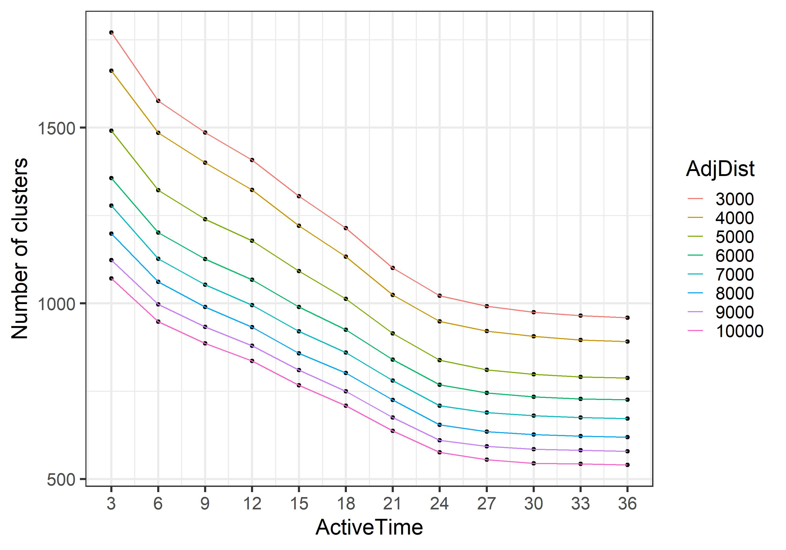

```{r setup, include=FALSE}
knitr::opts_chunk$set(
  echo = FALSE, 
  cache=FALSE, 
  message=FALSE, 
  warning=FALSE, 
  fig.retina = 3,
  fig.align = "center",
  out.width="80%")
```

```{r libraries}
library(tidyverse)
library(ggthemes)
library(sf)
library(ggpubr)
library(rnaturalearth)
library(rnaturalearthhires) # do we need, compile complains without
library(sp) # do we need, compile complains without
library(spotoroo)
library(lubridate)
library(gridExtra)
library(kableExtra)
library(ggforce)
```

```{r Run-Algorithm, include = FALSE}
if (any(!file.exists(c("data/VIC_hotspots_before_clustering.csv", 
                       "data/VIC_hotspots_raw.csv")))){
  system("Rscript scripts/Clustering-Python-setup.R")
} 

if (!file.exists("data/clustering_grid.csv")){
  system("python scripts/clustering_tune.py")
} 

if (any(!file.exists(c("figures/clustering_tuning_1.jpeg", 
                       "figures/clustering_tuning_2.jpeg")))){
  system("Rscript scripts/clustering_tune_vis.R")
}

if (!file.exists("data/VIC_hotspots_after_clustering.csv")){
  system("python scripts/main.py")
}

if (!file.exists("figures/fire_mov.jpeg")){
  system("Rscript scripts/FireMov.R")
}
```


## Introduction

The 2019-2020 Australia bushfire season was catastrophic in the scale of damage caused to agricultural resources, property, infrastructure, and ecological systems. By the end of 2020, the devastation attributable to these Black Summer fires included 33 lives lost, almost 19 million hectares of land burned, over 3,000 homes destroyed and AUD $1.7 billion in insurance losses, as well as an estimated 1 billion animals killed, including half of Kangaroo Island's population of koalas [@Filkov2020]. According to @climate2020, 2019 was the warmest year on record in Australia and capped off a period from 2013-2019 that represents seven of the nine warmest years. There is concern and expectation that impacts of climate change -- including more extreme temperatures, persistent drought, and changes in plant growth and landscape drying -- will worsen conditions for extreme bushfires [@climate2020, @Deb2020]. Contributing to the problem is that dry lightning represents the main source of natural ignition, and fires that start in remote areas deep in the temperate forests are difficult to access and monitor [@Abram2021]. Therefore, opportunities to detect fire ignitions, monitor bushfire spread, and understand movement patterns in remote areas are important for developing effective strategies to mitigate bushfire impact.

Remote satellite data provides a potential solution to the challenge of active fire detection and monitoring, and the Himawari-8 satellite represents a significant improvement in the technology by which this can be done. Launched in 2015 by the Japan Meteorological Agency, its 10-minute temporal resolution enables almost real-time monitoring of fires across East Asia and Australia. For this reason, development of algorithms to process pixels of its satellite imagery into hotspots -- i.e. pixels that represent likely fires -- is an active area of research (see for example @Xu2017, @Wickramasinghe2016, @Jang2019). We make use of the Japan Aerospace Exploration Agency (JAXA) wildfire product [@jaxa] that identifies the location and fire radiative power (FRP) of hotspots according to an algorithm developed by @Kurihara2020. 

Detection of bushfire ignition and movement requires the clustering of satellite hotspots into meaningful clusters, which may then be considered in their entirety or summarized by a trajectory. In this paper, we propose a spatiotemporal clustering algorithm to represent bushfires as clusters of hotspot pixels in order to (1) determine points of bushfire ignition and (2) track their movement over space and time. Inspired by two existing clustering algorithms, namely Density Based Spatial Clustering of Applications with Noise (DBSCAN) [@ester1996density] and Fire Spread Reconstruction (FSR) [@Loboda2007], our algorithm extends the functionality of DBSCAN's spatial clustering parameters to the additional temporal dimension, while drawing upon the fire movement dynamics presented in FSR and generalizing its specification of spatiotemporal parameters, thereby providing an intuitive, straightforward, and extendable approach to the complex problem of bushfire identification and monitoring. In clustering hotspots into bushfires of arbitrary shape and size, we capture key bushfire behavior: fire evolution occurs only forwards in time; fires can smolder undetectably for awhile, burn out, and merge with other bushfires; and solitary pixels that may not represent true fires should not be represented as a bushfire cluster.

The core functionality of this spatiotemporal clustering algorithm determines whether a hotspot represents a new ignition point or a continuation of an existing bushfire by comparing and combining cluster membership information via incremental updates from one time frame to the next. Our algorithm first slices the hotspot data by its temporal dimension according to a user-defined time step. This thereby divides the overall spatiotemporal clustering task into many smaller spatial clustering tasks that may be completed in parallel, where each frame can be considered a static snapshot in time. Within each time frame, hotspots that fall within the threshold of a user-defined spatial metric of each other are joined in a cluster. Then, proceeding sequentially, we identify whether or not a hotspot was observed in the previous time frame. If so, it retains its cluster membership from the previous time frame; if not, the hotspot adopts the membership of the nearest hotspot with which it has been clustered. If no such neighbor exists, a hotspot represents the start of a new fire. It is important to note that each hotspot does not necessarily represent an individual, so similar to DBSCAN's identification of noise, those clusters that does not pass the threshold of a minimum number of hotspots or exist for a minimum amount of time are labeled noise.

As emphasized by @kisilevich2009spatio, the selection of spatial resolution and time granularity -- and relevance of domain knowledge in their choice -- are imperative to the understanding and interpretation of resulting clusters. The incorrect choice for either can be highly influential to the shape and number of clusters discovered, and in the case of satellite hotspot data, will depend on the spatial resolution and temporal frequency at which images are captured. Therefore, we present a visualization heuristic for parameter tuning that enables selection of near-optimal values of the parameters, irrespective of the exact data source.

Finally, we implement this algorithm in R package `spotoroo`: Spatiotemporal Clustering of Satellite Hot Spot Data, available on CRAN. By enabling the user to cluster satellite hotspot data across space and time, this software provides the ability to relate findings to key factors in bushfire ignition and patterns in their spread (e.g. weather and fuel sources).

This paper is organised as follows. The next section provides an introduction to the literature on spatiotemporal clustering and bushfire modeling and dynamics. Section [Algorithm] describes the clustering algorithm, and [Package] discussed its implementation in `spotoroo` on CRAN. [Application] illustrates how the resulting data can be used to study bushfire ignition.


## Background

### Spatiotemporal clustering

@datamining2012 identify five categories of clustering algorithms: partitioning methods, hierarchical methods, density-based methods, grid-based methods, and model-based methods. Clustering of hotspot data lends itself nicely to density-based methods, which allow for the identification of clusters of various shapes and sizes, without requiring that the user pre-specify number of clusters -- these are two limitations of partitioning and hierarchical methods. We therefore focus on a review of density-based methods and refer the reader to @datamining2012 for algorithms in other categories and @kisilevich2009spatio for appropriate extensions to spatiotemporal data. *(Note here why grid-based methods would not be good for resolution of hotspot data.)*

Density-based methods separate regions constituting a high density of points separated by low-density regions by identifying pairwise distances between points, and then requiring that a threshold for  [@datamining2012]. Density Based Spatial Clustering of Applications with Noise (DBSCAN) [@ester1996density] is an influential implementation of this methodology developed in 1996 designed to address three challenges of clustering algorithms: (1) requirements of domain knowledge to determine the hyperparameters, (2) arbitrary shape of clusters and (3) computational efficiency. DBSCAN defines a maximum radius $\epsilon$ to construct a neighborhood around each point. It distinguishes between a core point, for which the number of points that fall in its neighborhood meets a minimum threshold, and a boundary point, whose neighborhood does not meet this threshold, but can be reached via overlapping neighborhoods from that of a core point. Intersecting neighborhoods are defined to be a cluster, while points that cannot be assigned to a cluster are identified as noise. DBSCAN also provides a heuristic to inform selection of  *(Note: Only mention DBSCAN's computational complexity for comparison if we have way to measure ours.)*

What is often identified as a limitation of DBSCAN -- its inability to differentiate between clusters of different densities and those adjacent to each other [@stdbscan] -- is of less concern for the application to satellite data, which by nature is a set of points corresponding to the equidistant center of pixels on grid of latitudes and longtitudes. However, its application to spatiotemporal clustering problems, which contain at least three dimensions -- spatial location (e.g. latitude and longitude) and time -- require specification of temporal granularity and treatment of temporal similarity [@kisilevich2009spatio]. As such, several extensions to DBSCAN's spatial clustering functionality have been proposed for spatiotemporal clustering solutions.

ST-DBSCAN [@stdbscan] was developed as an extension of DBSCAN's functionality to cluster points according to their non-spatial, spatial, and temporal attributes, and simultaneously address two of DBSCAN's limitations regarding identification of clusters of varying densities and differentiation of adjacent clusters. Therefore, in addition to DBSCAN's original metric to capture the spatial distance between two objects, ST-DBSCAN introduces a second metric that considers similarity of variables associated with temporal neighbors; that is, points observed in consecutive time steps.

More similar in their goals are (still to write up): Incremental DBSCAN [@ester1998incremental], Discovering Moving Clusters in Spatiotemporal Data [@Kalnis2005]

### Bushfire dynamics (clustering in literature)

@kisilevich2009spatio notes the importance of domain expertise in selection of parameters; for this reason, we also consider literature on bushfire dynamics *(TBD)* and satellite hotspot clustering for wildfire monitoring.

Fire Spread Reconstruction (FSR) [@Loboda2007] was developed to identify fire spread in the Russian boreal forest based on active fire detections from MODIS (Moderate Resolution Imaging Spectroradiometer), which has a temporal frequency of six hours. The algorithm proposed by the authors constructs a tree based on three rules: (1) the earliest observed hotspot is the root of the tree, (2) any node is within a 2.5km radius from its parent and (3) any node is observed no later than four days from its parent. When the tree is closed and there are still unassigned hotspots, the algorithm continues at the earliest unassigned hotspot to construct a new tree. Finally, each tree is a cluster, and the earliest hotspot is defined as the ignition point.

FSR's selection of parameters is specific to the region and data product used, and is therefore not immediately generalizable to other sources of satellite hotspot data. By implementation, each fire has a maximum length of four days *(is this true? implementation of sliding temporal window, if any, was not clear to me)*, which does not accurately represent what has been known to occur in Australia, where the (OCTOBER FIRE NAME) burned for months (citation). Additionally, due to its sequential construction of fires, two that may start in different locations but result in overlapping coverage are considered to be a single fire by the time they intersect. As a result, coverage of each fire may increase dramatically in a short time period, which does not accurately reflect the natural speed of a bushfire. *(let's discuss this)*

(Also [@hermawati2016] to show that DBSCAN has been used for fire clustering?)


## Algorithm 


```{r}
#au_map <- ne_states(country = 'Australia', returnclass = 'sf')
#vic_map <- au_map[7,]
data("vic_map")
hotspots_all <- read_csv("data/VIC_hotspots_raw.csv")
#memberships <- read_csv("data/VIC_hotspots_after_clustering.csv")
hotspots_all$fire_id <- read_csv("data/VIC_hotspots_after_clustering.csv") %>% select(fire_id)
#rm(memberships)
```


The spatiotemporal clustering algorithm is consist of 4 steps, (1) divide hotspots into intervals, (2) cluster hotspots spatially, (3) update the memberships and (4) handle noise. These four steps will be described in details in the rest of the section. 


**1. Divide hotspots into intervals**

One of the characteristics of the hotspot data is earlier hotspots are most likely to be the source of the later hotspots nearby. For this reason, we need to treat the temporal dimension specially. Our method is to define a sequence of intervals in which only spatially relationship between hotspots will be considered. The final clustering result is produced by letting later intervals to adopt information from the earlier intervals.

Another characteristic of the hotspot data is cloud cover could lead to missing observations of a bushfire in several hours. As a result, hotspots with a long interval may preserve direct association. To overcome this problem, we define a integer parameter $activeTime$ to predetermine the maximum time a fire can stay smouldering but undetectable by satellite before flaring up again.

Thus, the interval $s_t$ is defined by the following formula:

$$\boldsymbol{S}_t = [max(1,t-activeTime),t],~~t = 1,2,...,T$$
where $max(.)$ is the maximum function, $t$ is the time index and $T$ is the integer length of the time frame.

For example, if the dataset contains 48 hours of hotspot data and the $activeTime = 24~hours$, there will be 48 intervals defined by the algorithm, $\boldsymbol{S}_1,\boldsymbol{S}_2,..,\boldsymbol{S}_{48}$, where

\begin{align*}
\boldsymbol{S}_1 &= [1,1]\\
\boldsymbol{S}_2 &= [1,2]\\
&...\\
\boldsymbol{S}_{25} &= [1,25]\\
\boldsymbol{S}_{26} &= [2,26]\\
&...\\
\boldsymbol{S}_{47} &= [23,47]\\
\boldsymbol{S}_{48} &= [24,48]
\end{align*}

**2. Cluster hotspots spatially**

The previous step drops the temporal dimension. Hence, the following step only needs to address the hotspots spatially by introducing another parameter $adjDist$. $adjDist$ represents the potential distance a fire can spread with respect to the temporal resolution of the data. For example, let $AdjDist = 3000 m$ and the temporal resolution of the data is 10-minute, then the potential speed of the bushfire is $3000m/10~min = 18km/h$. 

Given a fixed value of $AdjDist$ and the interval $\boldsymbol{S}_t$, the algorithm will, 

(a) Append a randomly selected hotspot $h_i$ to a empty list $\boldsymbol{L}$, where $h_i$ is the $i$th hotspot in the interval $\boldsymbol{S}_t$, and let pointer $\boldsymbol{P}$ points to the first element of the list $\boldsymbol{L}$.

(b) Visit every $h_i$ where $h_i \notin \boldsymbol{L}$. If $geodesic(h_i, \boldsymbol{P})\leq AdjDist$, append $h_i$ to list $\boldsymbol{L}$. 

(c) Move pointer $\boldsymbol{P}$ to the next item of the list $\boldsymbol{L}$.

(d) Repeat (b) and (c) till the pointer $\boldsymbol{P}$ reaches to the end of the list $\boldsymbol{L}$.

(e) For all hotspots $h_i \in \boldsymbol{L}$, assign a new membership to them. Pop these hotspots from the interval $\boldsymbol{S}_t$. Repeat (a) to (e) if interval $\boldsymbol{S}_t$ is not empty.

(f) Recover the interval $\boldsymbol{S}_t$ and record the memberships.


Figure \ref{fig:step2figs} gives an concise example of this step.

```{r step2figs, fig.cap="An example of step 2 given 20 hotspots in interval $\\boldsymbol{S}_t$. (a) A hotspot is selected randomly as the first item of list $\\boldsymbol{L}$ and the pointer $\\boldsymbol{P}$. Hotspots in list $\\boldsymbol{L}$ are in red. Pointer $\\boldsymbol{P}$ is drawn with larger marker size. (b) Nearby hotspots of the pointer $\\boldsymbol{P}$ are appended to the list $\\boldsymbol{L}$. (c) Move pointer $\\boldsymbol{P}$ to the next item of list $\\boldsymbol{L}$ and append the nearby hotspots to list $\\boldsymbol{L}$. (d) The first cluster is identified via repeating substep (c). (e) Clear the list $\\boldsymbol{L}$, then randomly select an unassigned hotspot to identify another cluster. (f) The final clustering result is produced via repeating substep (d). The labels show the cluster each hotspot belongs to."}

set.seed(1256)
x <- rnorm(10, mean = 0, sd = 3)
y <- rnorm(10, mean = 0, sd = 2)
x <- c(x,rnorm(10, mean = 5, sd = 2))
y <- c(y,rnorm(10, mean = 5, sd = 3))
points <- data.frame(x=x, y=y)

x <- c(x,rnorm(10, mean = 6, sd = 2))
y <- c(y,rnorm(10, mean = 7, sd = 2))
points_2 <- data.frame(x=x, y=y)

ggplot(points) +
  geom_point(aes(x,y), shape = 21, size = 1) +
  geom_point(data = NULL, aes(points$x[3], 
                              points$y[3],
                              col = "L"),
                              size = 3) +
  geom_circle(data = NULL, aes(x0 = points$x[3], y0 = points$y[3], r = 3)) +
  coord_fixed() +
  theme_bw() +
  theme(axis.line=element_blank(),
      axis.text.x=element_blank(),
      axis.text.y=element_blank(),
      axis.ticks=element_blank(),
      axis.title.x=element_blank(),
      axis.title.y=element_blank()) +
  theme(legend.position = "none") +
  scale_color_manual(values = "red") +
  labs(col = "") +
  ggtitle("Step 2: (a)") -> p1

ggplot() +
  geom_point(data = points, aes(x, y), size = 1, shape = 21) +
  geom_segment(data = NULL, aes(x = points$x[3], 
                                y = points$y[3],
                                xend = points$x[c(2, 4, 7, 11, 18)],
                                yend = points$y[c(2, 4, 7, 11, 18)])) +
  geom_point(data = NULL, aes(points$x[c(2, 4, 7, 11, 18)], 
                              points$y[c(2, 4, 7, 11, 18)],
                              col = "L")) +
  geom_point(data = NULL, aes(points$x[3], 
                              points$y[3],
                              col = "L"),
                              size = 3) +
  geom_circle(data = NULL, aes(x0 = points$x[3], y0 = points$y[3], r = 3)) +

  coord_fixed() +
  theme_bw() +
  theme(legend.position = "none") +
  theme(axis.line=element_blank(),
      axis.text.x=element_blank(),
      axis.text.y=element_blank(),
      axis.ticks=element_blank(),
      axis.title.x=element_blank(),
      axis.title.y=element_blank()) +
  scale_color_manual(values = "red") +
  labs(col = "", size = "") +
  ggtitle("Step 2: (b)") -> p2


ggplot() +
  geom_point(data = points, aes(x, y), size = 1, shape = 21) +
  geom_segment(data = NULL, aes(x = points$x[7], 
                                y = points$y[7],
                                xend = points$x[c(5, 15)],
                                yend = points$y[c(5, 15)])) +
  geom_point(data = NULL, aes(points$x[c(2, 3, 4, 11, 18, 5, 15)], 
                              points$y[c(2, 3, 4, 11, 18, 5, 15)],
                              col = "L")) +
  geom_point(data = NULL, aes(points$x[7], 
                              points$y[7],
                              col = "L"),
                              size = 3) +
  geom_circle(data = NULL, aes(x0 = points$x[7], y0 = points$y[7], r = 3)) +

  coord_fixed() +
  theme_bw() +
  theme(legend.position = "none") +
  theme(axis.line=element_blank(),
      axis.text.x=element_blank(),
      axis.text.y=element_blank(),
      axis.ticks=element_blank(),
      axis.title.x=element_blank(),
      axis.title.y=element_blank()) +
  scale_color_manual(values = "red") +
  labs(col = "", size = "") +
  ggtitle("Step 2: (c)") -> p3

ggplot() +
  geom_point(data = points, aes(x, y), size = 1, shape = 21) +
  geom_point(data = NULL, aes(points$x[c(2, 3, 4, 7, 11, 18, 5, 12, 13, 14, 15, 16, 17, 18)], 
                              points$y[c(2, 3, 4, 7, 11, 18, 5, 12, 13, 14, 15, 16, 17, 18)],
                              col = "L")) +
  
  geom_point(data = NULL, aes(points$x[16], 
                              points$y[16],
                              col = "L"),
                              size = 3) +
  geom_circle(data = NULL, aes(x0 = points$x[16], y0 = points$y[16], r = 3)) +
  coord_fixed() +
  theme_bw() +
  theme(legend.position = "none") +
  theme(axis.line=element_blank(),
      axis.text.x=element_blank(),
      axis.text.y=element_blank(),
      axis.ticks=element_blank(),
      axis.title.x=element_blank(),
      axis.title.y=element_blank()) +
  scale_color_manual(values = "red") +
  labs(col = "", size = "") +
  ggtitle("Step 2: (d)") -> p4

ggplot() +
  geom_point(data = points, aes(x, y), size = 1, shape = 21) +
  geom_point(data = NULL, aes(points$x[-c(2, 3, 4, 7, 11, 18, 5, 12, 13, 14, 15, 16, 17, 18, 19, 20)], 
                              points$y[-c(2, 3, 4, 7, 11, 18, 5, 12, 13, 14, 15, 16, 17, 18, 19, 20)],
                              col = "L")) +
  
  geom_point(data = NULL, aes(points$x[6], 
                              points$y[6],
                              col = "L"),
                              size = 3) +
  geom_circle(data = NULL, aes(x0 = points$x[6], y0 = points$y[6], r = 3)) +
  coord_fixed() +
  theme_bw() +
  theme(legend.position = "none") +
  theme(axis.line=element_blank(),
      axis.text.x=element_blank(),
      axis.text.y=element_blank(),
      axis.ticks=element_blank(),
      axis.title.x=element_blank(),
      axis.title.y=element_blank()) +
  scale_color_manual(values = "red") +
  labs(col = "", size = "") +
  ggtitle("Step 2: (e)") -> p5


point_cols <- rep(1, 20)
point_cols[c(2, 3, 4, 7, 11, 18, 5, 12, 13, 14, 15, 16, 17, 18)] <- 2
point_cols[19] <- 3
point_cols[20] <- 4

ggplot() +
  geom_text(data = points, aes(x, y, label = point_cols)) +
  coord_fixed() +
  theme_bw() +
  theme(legend.position = "none") +
  theme(axis.line=element_blank(),
      axis.text.x=element_blank(),
      axis.text.y=element_blank(),
      axis.ticks=element_blank(),
      axis.title.x=element_blank(),
      axis.title.y=element_blank()) +
  ggtitle("Step 2: (f)") -> p6


library(patchwork)

(p1 + p2 + p3)/(p4 + p5 + p6)
```


**3. Update the memberships**

With clustering results for each interval, the next step is to update the memberships by bringing in information from earlier intervals.

This step starts from $t=2$ till $t=T$. Given the interval $\boldsymbol{S}_t$, the algorithm will,

(a) Let $h_i$ carries over from its membership in $\boldsymbol{S}_{t-1}$, if $h_i$ belongs to $\boldsymbol{S}_{t-1}$, where $h_i$ is the $i$th hotspot in the interval $\boldsymbol{S}_t$. These hotspots are collected by a set $\boldsymbol{H}_s = \{h_s^1,h_s^2,...\}$.

(b) Let $\boldsymbol{H}_c = \{h_c^1,h_c^2,...\}$, where $h_c^i$ is the $i$th hotspot in set $\boldsymbol{H}_c$ and $h_c^i$ belongs to $\boldsymbol{S}_t$ but does not belong to $\boldsymbol{S}_{t-1}$. If $h_c^i$ being clustered into the same component with $h_s^j$ in interval $\boldsymbol{S}_t$, let $h_c^i$ carries over from the membership of the nearest $h_s^j$, where $h_s^j$ is the $j$th hotspot in set $\boldsymbol{H}_s$. 

Figure \ref{fig:step3figs} gives an example of this step.

```{r}
point_cols2 <- rep("a", 30)
point_cols2[19] <- "b"
point_cols2[c(1, 8, 6, 9, 10)] <- "c"

ggplot() +
  geom_point(data = points_2, aes(x, y, col = paste0("Cluster ", as.character(point_cols2)), shape = c(1:30)<=20)) +
  coord_fixed() +
  theme_bw() +
  theme(legend.position = "right") +
  theme(axis.line=element_blank(),
      axis.text.x=element_blank(),
      axis.text.y=element_blank(),
      axis.ticks=element_blank(),
      axis.title.x=element_blank(),
      axis.title.y=element_blank()) +
  labs(col = "", shape = expression("Hotspots "*" in "*S[t-1])) +
  scale_shape_manual(values = c(1, 2)) +
  ggtitle(quote(S[t])) -> p1


ggplot() +
  geom_text(data = points, aes(x, y, label = point_cols)) +
  coord_fixed() +
  theme_bw() +
  theme(legend.position = "left") +
  theme(axis.line=element_blank(),
      axis.text.x=element_blank(),
      axis.text.y=element_blank(),
      axis.ticks=element_blank(),
      axis.title.x=element_blank(),
      axis.title.y=element_blank()) +
  labs(col = "") +
  ggtitle(quote(S[t-1])) -> p2


```

```{r}
X1 <- as.data.frame(points_2[point_cols2 == "a",])
hull_1 <- chull(X1)
hull_1 <- c(hull_1, hull_1[1])

X2 <- as.data.frame(points_2[point_cols2 == "c",])
hull_2 <- chull(X2)
hull_2 <- c(hull_2, hull_2[1])

ggplot() +
  geom_text(data = points_2[1:20, ], aes(x, y, label = point_cols), col = "blue") +
  geom_point(data = points_2[21:30, ], aes(x, y), col = "red") +
  geom_polygon(data = X1[hull_1,], aes(x=x, y=y), fill = "black", alpha = 0.1) +
  geom_polygon(data = X2[hull_2,], aes(x=x, y=y), fill = "black", alpha = 0.1) +
  coord_fixed() +
  theme_bw() +
  theme(axis.line=element_blank(),
      axis.text.x=element_blank(),
      axis.text.y=element_blank(),
      axis.ticks=element_blank(),
      axis.title.x=element_blank(),
      axis.title.y=element_blank()) +
  labs(col = "", 
       shape = expression("Hotspots "*" in "*S[t-1]), 
       title = "Step 3: (a)", 
       subtitle = quote(S[t])) -> p3
```


```{r}
ggplot(data = mutate(points_2, group = rep("", 30))) +
  geom_text(aes(x, y, label = toupper(point_cols2))) +
  geom_polygon(data = X1[hull_1,], aes(x=x, y=y), fill = "black", alpha = 0.1) +
  geom_polygon(data = X2[hull_2,], aes(x=x, y=y), fill = "black", alpha = 0.1) +
  coord_fixed() +
  theme_bw() +
  theme(legend.position = "right") +
  theme(axis.line=element_blank(),
      axis.text.x=element_blank(),
      axis.text.y=element_blank(),
      axis.ticks=element_blank(),
      axis.title.x=element_blank(),
      axis.title.y=element_blank()) +
  ggtitle(bquote(S[t]~"before updating")) -> p5
```


```{r step3figs, fig.cap = "An example of step 3. In this example, there are 30 hotspots belong to interval $\\boldsymbol{S}_t$. (a) 20 out of 30 hotspots belong to both interval $\\boldsymbol{S}_t$ and interval $\\boldsymbol{S}_{t-1}$. Let these hotspots carry over from their memberships in $\\boldsymbol{S}_{t-1}$. They are annotated in blue with membership labels. Points in red are the rest 10 hotspots that only belong to interval $\\boldsymbol{S}_t$. (b) For each red point, let it carry over from the membership of the nearest blue label which shares the same component (according to the spatial clustering result of this interval) in interval $\\boldsymbol{S}_t$. "}

final_labels <- c(point_cols, 4, 2, 4, 4, 2, 2, 2, 4, 4, 2)

X1 <- as.data.frame(points_2[final_labels == "1",])
hull_1 <- chull(X1)
hull_1 <- c(hull_1, hull_1[1])

X2 <- as.data.frame(points_2[final_labels == "2",])
hull_2 <- chull(X2)
hull_2 <- c(hull_2, hull_2[1])

X3 <- as.data.frame(points_2[final_labels == "3",])
hull_3 <- chull(X3)
hull_3 <- c(hull_3, hull_3[1])

X4 <- as.data.frame(points_2[final_labels == "4",])
hull_4 <- chull(X4)
hull_4 <- c(hull_4, hull_4[1])

ggplot() +
  geom_text(data = points_2, aes(x, y, label = final_labels, col = c(1:30)<=20)) +
  geom_polygon(data = X1[hull_1,], aes(x=x, y=y), fill = "black", alpha = 0.1) +
  geom_polygon(data = X2[hull_2,], aes(x=x, y=y), fill = "black", alpha = 0.1) +
  geom_polygon(data = X3[hull_3,], aes(x=x, y=y), fill = "black", alpha = 0.1) +
  geom_polygon(data = X4[hull_4,], aes(x=x, y=y), fill = "black", alpha = 0.1) +
  coord_fixed() +
  theme_bw() +
  theme(legend.position = "none") +
  theme(axis.line=element_blank(),
      axis.text.x=element_blank(),
      axis.text.y=element_blank(),
      axis.ticks=element_blank(),
      axis.title.x=element_blank(),
      axis.title.y=element_blank()) +
  labs(col = expression("Hotspots "*" in "*S[t-1]), title = "Step 3: (b)", subtitle = quote(S[t])) +
  scale_color_manual(values = c("red", "blue")) -> p4

(p5 + p3 + p4)
```

**4. Handle noise**

After performing step 3, all membership labels will be produced. However, a noticeable amount of small clusters could exist. We provide a noise filter in the last step to address this issue. 

Parameter $minPts$ is the minimum number of hotspots a cluster contains and parameter $minTime$ is the minimum time a cluster lasts. Any cluster that doesn't satisfy this two conditions will be assigned with membership $-1$ to indicate noise. 

### Result

The result of this spatiotemporal clustering algorithm applied on the hotspot data is a vector of memberships with length equals to the number of observations in the data.

## Application  

In this part, we will demonstrate the implementation of this algorithm using the R package \CRANpkg{spotoroo} and its potential use in studying bushfire ignition.

### Data source

The illustration will use the wild fire product (produced from Himawari-8) supplied by the P-Tree System, Japan Aerospace Exploration Agency (JAXA) [-@jaxa] as the data source. This wild fire product will be referred as the hotspot data in this paper. It contains records of 1989572 hotspots from October 2019 to March 2020 in the full disk of 140 \textdegree east longitude with 0.02 \textdegree spatial resolution and 10 minutes temporal resolution.

The data pre-processing procedure includes selecting hotspots within the boundary of Victoria and filtering hotspots with a threshold (irradiance over 100 watts per square metre) suggested by landscape ecologist and spatial scientist Dr. Grant Williamson [-@hotspots]  to reduce noise from the background.

The final hotspot dataset contains 75936 observations with ID, longitude, latitude and observed date as fields. The overall distribution of these hotspots is shown in Figure \ref{fig:hotspots}.


```{r hotspots, fig.cap="The distribution of hotspots in Victoria during 2019-2020 Australia bushfire season."}
if (!file.exists("figures/before_clustering.png")){
  ggplot() +
  geom_sf(data = vic_map, col = NA) +
  geom_point(data = hotspots_all, aes(lon, lat), alpha = 0.3) +
  theme_map() -> p

  ggsave(filename = "figures/before_clustering.png", dpi = 300, plot = p)
}


knitr::include_graphics("figures/before_clustering.png")
```

### Clustering the Himawari-8 hotspots

The package can be installed from CRAN using 

```
install.packages("spotoroo")
```

To perform the clustering algorithm on the Himawari-8 hotspot data, using

```{r}
library(spotoroo)
result <- hotspot_cluster(hotspots = hotspots,
                          lon = "lon",
                          lat = "lat",
                          obsTime = "obsTime",
                          activeTime = 24,
                          adjDist = 3000,
                          minPts = 4,
                          minTime = 3,
                          ignitionCenter = "mean",
                          timeUnit = "h",
                          timeStep = 1)
```


### Determining the ignition point and time for individual fires

Based on the clustering result, ignition location for each cluster can be computed. The strategy is to select the earliest hotspot of a cluster as its ignition point. Besides, if there are multiple earliest hotspots belong to the same cluster, the centroid of these hotspots is used as the ignition location. According to this method, ignition points over 6 months are given in Figure \ref{fig:clusteringfinalresults} and Figure \ref{fig:app3}. 


```{r clusteringfinalresults, fig.cap=" The distribution of bushfire ignitions in Victoria during 2019-2020 Australian bushfire season."}
hotspots_all %>%
  group_by(fire_id) %>%
  summarise(hour_id = min(hour_id)) %>%
  ungroup() -> temp

ignition <- left_join(temp, hotspots_all) %>%
  group_by(fire_id) %>%
  summarise(time = mean(`#obstime`), lon = mean(lon), lat = mean(lat))

ignition <- mutate(ignition, year = year(time), month = month(time), day = day(time))

ggplot(ignition) +
  geom_sf(data = vic_map, col = NA) +
  geom_point(aes(lon, lat), alpha = 0.3) +
  theme_map() -> p1

p1  
```


```{r ignitionbar}
ignition %>%
  group_by(year, month) %>%
  count() %>%
  ggplot() +
  geom_line(aes(factor(month.abb[month], levels = c("Oct", "Nov", "Dec", "Jan", "Feb", "Mar")), n, group = 1)) +
  xlab("Month") +
  ylab("Count") +
  labs(tag = "(a)") +
  theme_bw() -> p3
```


```{r}
# light
filter(ignition, year == 2020, month == 1, day == 24) %>%
ggplot() +
  geom_sf(data = vic_map, col = NA) +
  geom_point(aes(lon, lat), alpha = 0.6) +
  ggtitle("2020.01.24") +
  labs(tag = "(b)") +
  theme_map() -> p1
```


```{r app3, fig.cap="(a) Number of bushfires ignited from October 2019 to March 2020. (b) The distribution of the bushfire ignitions on a light day (c) and a heavy day. There are 3 ignitions on January 24, 2020 and 106 ignitions on December 18, 2019."}
# heavy
filter(ignition, year == 2019, month == 12, day == 18) %>%
ggplot() +
  geom_sf(data = vic_map, col = NA) +
  geom_point(aes(lon, lat), alpha = 0.6) +
  ggtitle("2019.12.18") +
  labs(tag = "(c)") +
  theme_map() -> p2

p3 / (p1 + p2)
```


### Tracking fire movement

<center> <em> Display showing how a fire moves over time, maybe two or more fires </em> </center>


```{r fig.height=8, eval=FALSE}
tarid <- c(300)

add_lag_cen <- function(x, times = 10) {
  for (i in 2:times) {
    x <- mutate(x, "cen_lon_{i}" := lag(!!sym(paste0("cen_lon_", i-1)))) %>%
      mutate("cen_lat_{i}" := lag(!!sym(paste0("cen_lat_", i-1))))
  }
  
  x
  
}

hotspots_all %>%
  select(fire_id, dettime, lon, lat) %>%
  filter(fire_id %in% c(tarid)) %>%
  mutate(new_date = as.character(floor_date(dettime, unit = "12 hours"))) %>%
  group_by(fire_id, new_date) %>%
  summarise(cen_lon = mean(lon), cen_lat = mean(lat)) %>%
  group_by(fire_id) %>%
  mutate(cen_lon_1 = lag(cen_lon), cen_lat_1 = lag(cen_lat)) %>%
  add_lag_cen(30) -> cen

hotspots_all %>%
  select(fire_id, dettime, lon, lat) %>%
  filter(fire_id %in% c(tarid)) %>%
  mutate(new_date = as.character(floor_date(dettime, unit = "12 hours"))) %>%
  left_join(cen) %>%
ggplot() +
  geom_jitter(aes(lon, lat, col = as.character(fire_id)), alpha = 0.3) +
  geom_point(aes(cen_lon, cen_lat), col = "red", size = 1.2) +
  # geom_point(aes(cen_lon_1, cen_lat_1), col = "blue", size = 1) +
  # geom_point(aes(cen_lon_2, cen_lat_2), col = "blue", size = 1) +
  # geom_point(aes(cen_lon_3, cen_lat_3), col = "blue", size = 1) +
  # geom_point(aes(cen_lon_4, cen_lat_4), col = "blue", size = 1) +
  # geom_point(aes(cen_lon_5, cen_lat_5), col = "blue", size = 1) +
  # geom_point(aes(cen_lon_6, cen_lat_6), col = "blue", size = 1) +
  # geom_point(aes(cen_lon_7, cen_lat_7), col = "blue", size = 1) +
  # geom_point(aes(cen_lon_8, cen_lat_8), col = "blue", size = 1) +
  # geom_point(aes(cen_lon_9, cen_lat_9), col = "blue", size = 1) +
  # geom_point(aes(cen_lon_10, cen_lat_10), col = "blue", size = 1) +
  # geom_point(aes(cen_lon_11, cen_lat_11), col = "blue", size = 1) +
  # geom_point(aes(cen_lon_12, cen_lat_12), col = "blue", size = 1) +
  # geom_point(aes(cen_lon_13, cen_lat_13), col = "blue", size = 1) +
  # geom_point(aes(cen_lon_14, cen_lat_14), col = "blue", size = 1) +
  # geom_point(aes(cen_lon_15, cen_lat_15), col = "blue", size = 1) +
  # geom_point(aes(cen_lon_16, cen_lat_16), col = "blue", size = 1) +
  # geom_point(aes(cen_lon_17, cen_lat_17), col = "blue", size = 1) +
  # geom_point(aes(cen_lon_18, cen_lat_18), col = "blue", size = 1) +
  # geom_point(aes(cen_lon_19, cen_lat_19), col = "blue", size = 1) +
  # geom_point(aes(cen_lon_20, cen_lat_20), col = "blue", size = 1) +
  # geom_point(aes(cen_lon_21, cen_lat_21), col = "blue", size = 1) +
  # geom_point(aes(cen_lon_22, cen_lat_22), col = "blue", size = 1) +
  # geom_point(aes(cen_lon_23, cen_lat_23), col = "blue", size = 1) +
  # geom_point(aes(cen_lon_24, cen_lat_24), col = "blue", size = 1) +
  
  geom_segment(aes(cen_lon, cen_lat, xend = cen_lon_1, yend = cen_lat_1)) +
  geom_segment(aes(cen_lon_1, cen_lat_1, xend = cen_lon_2, yend = cen_lat_2)) +
  geom_segment(aes(cen_lon_2, cen_lat_2, xend = cen_lon_3, yend = cen_lat_3)) +
  geom_segment(aes(cen_lon_3, cen_lat_3, xend = cen_lon_4, yend = cen_lat_4)) +
  geom_segment(aes(cen_lon_4, cen_lat_4, xend = cen_lon_5, yend = cen_lat_5)) +
  geom_segment(aes(cen_lon_5, cen_lat_5, xend = cen_lon_6, yend = cen_lat_6)) +
  geom_segment(aes(cen_lon_6, cen_lat_6, xend = cen_lon_7, yend = cen_lat_7)) +
  geom_segment(aes(cen_lon_7, cen_lat_7, xend = cen_lon_8, yend = cen_lat_8)) +
  geom_segment(aes(cen_lon_8, cen_lat_8, xend = cen_lon_9, yend = cen_lat_9)) +
  geom_segment(aes(cen_lon_9, cen_lat_9, xend = cen_lon_10, yend = cen_lat_10)) +
  geom_segment(aes(cen_lon_10, cen_lat_10, xend = cen_lon_11, yend = cen_lat_11)) +
  geom_segment(aes(cen_lon_11, cen_lat_11, xend = cen_lon_12, yend = cen_lat_12)) +
  geom_segment(aes(cen_lon_12, cen_lat_12, xend = cen_lon_13, yend = cen_lat_13)) +
  geom_segment(aes(cen_lon_13, cen_lat_13, xend = cen_lon_14, yend = cen_lat_14)) +
  geom_segment(aes(cen_lon_14, cen_lat_14, xend = cen_lon_15, yend = cen_lat_15)) +
  geom_segment(aes(cen_lon_15, cen_lat_15, xend = cen_lon_16, yend = cen_lat_16)) +
  geom_segment(aes(cen_lon_16, cen_lat_16, xend = cen_lon_17, yend = cen_lat_17)) +
  geom_segment(aes(cen_lon_17, cen_lat_17, xend = cen_lon_18, yend = cen_lat_18)) +
  geom_segment(aes(cen_lon_18, cen_lat_18, xend = cen_lon_19, yend = cen_lat_19)) +
  geom_segment(aes(cen_lon_19, cen_lat_19, xend = cen_lon_20, yend = cen_lat_20)) +
  geom_segment(aes(cen_lon_20, cen_lat_20, xend = cen_lon_21, yend = cen_lat_21)) +
  geom_segment(aes(cen_lon_21, cen_lat_21, xend = cen_lon_22, yend = cen_lat_22)) +
  geom_segment(aes(cen_lon_22, cen_lat_22, xend = cen_lon_23, yend = cen_lat_23)) +
  geom_segment(aes(cen_lon_23, cen_lat_23, xend = cen_lon_24, yend = cen_lat_24)) +
  geom_segment(aes(cen_lon_24, cen_lat_24, xend = cen_lon_25, yend = cen_lat_25)) +
  facet_wrap(~new_date) +
  theme_bw(base_size = 10) +
  theme(legend.position = "bottom") +
  scale_color_brewer(palette = "Dark2") +
  labs(color = "Fire ID")
```


### Allocating resources for future fire prevention

Merging data with camp sites, CFA, roads, ... 

### Effects of parameter choices

There are two parameters that being introduced in the outline of the algorithm, which are $AdjDist$ and $ActiveTime$. The optimal choice of these two parameters is not known but can be tuned using a visualization tool.

Considering the relationships between $AdjDist$, $ActiveTime$ and the number of clusters in the clustering result, increase either $AdjDist$ or $ActiveTime$ will usually reduce the number of clusters. However, if there are large gaps between clusters spatially and temporally, increase these two parameters will not significantly reduce the number of clusters. Given one of the metrics to evaluate the goodness of the clustering result is the gap between clusters, the optimal choice of $AdjDist$ and $ActiveTime$ can be chosen when they have minimum impact on the number of clusters. However, under this setting, the optimal $ActiveTime$ and $AdjDist$ will approach to infinitely as the number of clusters approach to 1. Hence, a restriction needs to be applied on this optimization. Increase of $ActiveTime$ and $AdjDist$ will only be allowed when there is a major fall of the number of clusters. Based on this rule, a visualization tool inspired by the scree plot used in the principal component analysis is developed. Similar to the scree plot, users need to determine the $ActiveTime$ and $AdjDist$ to capture most of the decrease of the number of clusters. Figure \ref{fig:vis1} and \ref{fig:vis2} show the parameter tuning process by using this visualization tool. The final choice of $ActiveTime$ is $24$ hours and $AdjDist$ is $3000$ metres.


```{r vis1, fig.cap="A visualization tool for parameter tuning . It works like a scree plot. Major falls of the number of clusters are observed when $AdjDist < 3000$ so the reasonable choice of $AdjDist$ is 3000m."}

```

```{r vis2, fig.cap="Major falls of the number of clusteres are observed when $ActiveTime < 24$, so the reasonable choice of $ActiveTime$ is 24 hours."}

```

## Implementation

The algorithm is available in the R package \pkg{spotoroo}.

### Installation

The package can be installed from CRAN using 

```
install.packages("spotoroo")
```

and the developmental version from github using

```
install.packages("remotes")
remotes::install_github("TengMCing/spotoroo")
```

### Usage

A sample data set is provided with the package, to illustrate its use.  The function `hotspot_cluster` performs the spatial clustering. Here we have called it fir the sample data, specifying the spatial and temporal variables (lon, lat, obsTime), and several parameters to the algorithm. A summary of the results is printed when the algorithm completes. 

```{r eval=TRUE, echo=TRUE, message=TRUE}
library(spotoroo)
library(tidyverse)
result <- hotspot_cluster(hotspots,
                          lon = "lon",
                          lat = "lat",
                          obsTime = "obsTime",
                          activeTime = 24,
                          adjDist = 3000,
                          minPts = 4,
                          minTime = 3,
                          ignitionCenter = "mean",
                          timeUnit = "h",
                          timeStep = 1)
```

For this sample of data, the result contains `r length(unique(result$))

```{r fig.cap="Automatic plot of results"}
plot(result, bg = plot_vic_map())
```

```{r out.width = "100%"}
plot(result,
     type = "mov",
     cluster = 1:6,
     step = 6,
     hotspot = TRUE,
     bg = plot_vic_map())
```

```{r out.width = "100%"}
plot(result, "timeline", 
     dateLabel = "%b %d", 
     mainBreak = "1 week", 
     minorBreak = "1 day")
```

### Functions

## Summary


<!--
This file is only a basic article template. For full details of _The R Journal_ style and information on how to prepare your article for submission, see the [Instructions for Authors](https://journal.r-project.org/share/author-guide.pdf).
-->

## Acknowledgements

- The code and files to reproduce this work are at XXX
- Data on hotspots can be downloaded from XXX


\bibliography{RJreferences}
